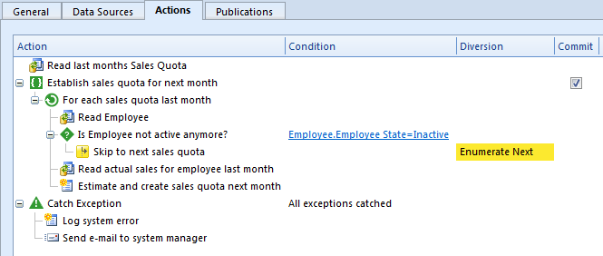

## Actions

Actions are used by Tasks, Agents, Web Services and Rules to define operations to perform during execution.

*   **Blocks**. Use Blocks to organize and control the different sets of actions. A block can contain effects, controls, and other blocks. Use Controls and blocks to control the flow of execution.Each block type has different characteristics to allow control of flow, transactions, iterations, and exception handling.
*   **Controls**. Use Controls in combination with blocks to control the flow of execution.
*   **Effects**. Use Effects to add specific actions, like reading data, creating data, opening forms, importing data etc.

The actions can be viewed and edited in the hierarchical tree view shown above, or in a [diagram](actions/action diagram.md) which displays the action flow using a Business Process Modeling Notation inspired graphical notation.

<table cellpadding="0" cellspacing="0" width="100%" class="cdclvSuggestTable">

<tbody>

<tr>

<td width="100%" class="cdclvSuggestTitle">Topics in "Actions"</td>

<td class="cdclvSuggestTitle"><nobr>5 items</nobr></td>

</tr>

<tr>

<td class="cdclvCategoryCont" colspan="2">

<table cellpadding="0" cellspacing="0" width="100%">

<tbody>

<tr>

<td valign="top" class="cdclvCategoryCol1">[Blocks](actions/blocks.md)</td>

<td valign="top" class="cdclvCategoryCol2">[Controls](actions/controls.md)</td>

</tr>

<tr class="cdclvCategoryRowAlt">

<td valign="top" class="cdclvCategoryCol1">[Effects](actions/effects.md)</td>

<td valign="top" class="cdclvCategoryCol2">[Defining Actions](actions/defining actions.md)</td>

</tr>

<tr>

<td valign="top" class="cdclvCategoryCol1">[Action Diagram](actions/action diagram.md)</td>

<td valign="top" class="cdclvCategoryCol2"></td>

</tr>

</tbody>

</table>

</td>

</tr>

</tbody>

</table>