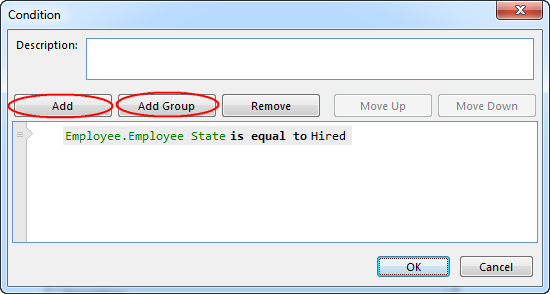
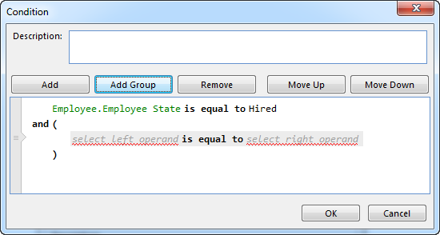

## Add an Expression or Group

To add an expression or a group, place the cursor where you want to add the element, and then click **Add** or **Add Group** respectively. Keyboard shortcuts are also available for these operations; press CTRL+A to add an expression, or press CTRL+SHIFT+A to add a group.

A new expression that is added is initially not valid, as it contains placeholders for the left and right operands that needs to edited. A new group also contains a new expression with operand placeholders.

The new expression or group is added after the selected line.

