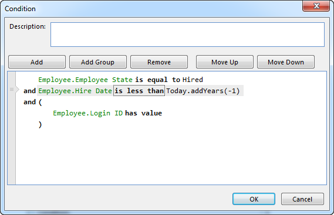

## Change the Order of Expressions and Groups

To change the order of expressions and groups, select the expression or group to move, and then click Move Up or Move Down. Keyboard shortcuts are also available for these operations; press SHIFT+ALT+UP ARROW to move the element up, or press SHIFT+ALT+DOWN ARROW to move the element down. To select a group, click one of the parentheses of the group, or the preceeding operator.

Expressions and groups that are moved continuously in one direction, will be moved into any adjacent groups, and out of any enclosing groups.  

The expression is moved up, and thereby out of the enclosing group.

The expression is moved down.

