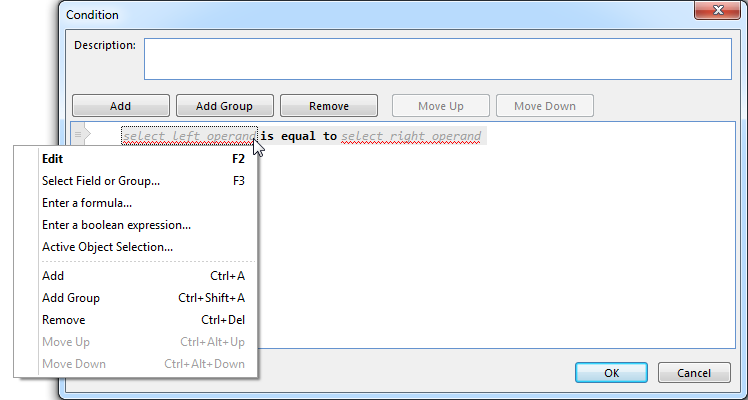
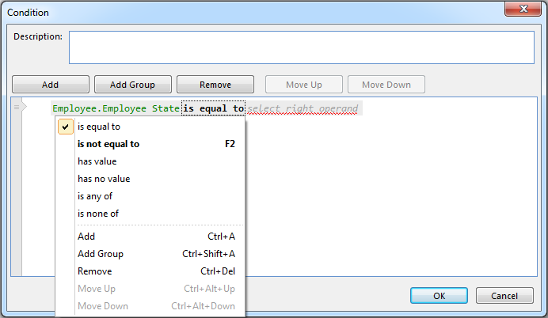
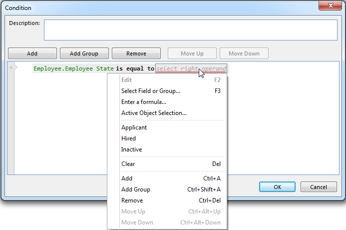

## Edit an Expression

Editing an expression involves changing the operands and operator. There are many different scenarios where the available combinations of operands and operators vary. Typically the available options for the operands and operators are determined by the context it is used in, the available data sources, and the preceeding part of the expression. For more information on available combinations, see [Condtitions](../../conditions.md).

To change the operands in an expression, do one of the following:

*   Right click the operand, and select the type of operand from the list.
*   Select the operand and press F4, and then select the type of operand from the list.
*   Double click the operand, which performs the default action, usually Edit, or opens the list of operands if no default action is available.
*   Select the operand and press F2 to edit an existing operand.
*   Select the operand and press F3 to select a field or group as the operand.

Depending of the type of operand that is selected, a new window appears to let you finish defining the operand.

To change the operator in an expression, do one of the following:

*   Right click the operator, and select the operator from the list.
*   Select the operator and press F4, and then select the operator from the list.
*   Double click the operator to select the next operator in the list of operators.
*   Select the operatorand press F2, to select the next operator in the list of operators.

The figures below illustrate the option of right clicking.

