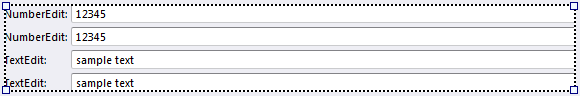

## Group

The group is a box without header and border that can contain other controls. The main usage of the group is to divide the form into smaller parts and stack other controls vertically or horizontally.

In this figure, the groups are colored individually , and the orientation is displayed, for illustration purposes.  

To achieve the desired [layout](../../view layout fundamentals.md), combine several groups and other containers, and place them next to or inside each other, with different orientation.

In certain situations groups are created automatically. This is done to simplify the moving of controls, and support more intuitive drag and drop operations. For example when a group contains other controls which are stacked vertically, and you want two of them to share one line, you can simply drag it to the desired position. In this case an extra group is required, and automatically created, to stack the two controls horizontally.

Groups that are empty, can in certain situations automatically be deleted

The group control can easily be changed into a [group box](group box.md) control, by changing the **Container Type**.  

It is not possible to move groups by dragging them with the mouse. To do this, first change the group to a group box, move the group box, and change the group box to a group.  

In this article

* * *

*   [Properties](#properties)

* * *

## Properties

See [Common Container Properties](common container properties.md) and [Common Control Properties](../common control properties.md).