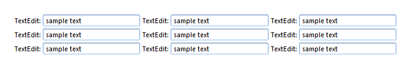
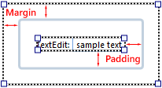
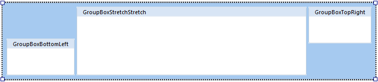

## View Layout Fundamentals

Creating a good layout is perhaps one of the most important, and difficult, tasks of building a view. The characteristics of a good layout can be intangible, and small changes can make a big difference.

Controls are combined and arranged visually to establish a layout for the view. Containers are used to create areas in the layout, which are then filled by stacking other controls.

The most important controls during layout are the [containers](desktop controls/containers.md) and especially the [group](desktop controls/containers/group.md) and the [group box](desktop controls/containers/group box.md). Since the group and group boxes are interchangable, we will use group as a common term in this article. In the following figures, some groups are blown up and have been given different colors for illustration purposes.

In this article

* * *

*   [Grouping Controls](#grouping-controls)

*   [Grouping Groups](#grouping-groups)

*   [Spacing](#spacing)

*   [Alignment](#alignment)

* * *

## Grouping Controls

A group can contain other controls, and stack them either vertically,

or horizontally,

by setting the **Orientation**.

The container control which holds a control, is often called the parent of the control.

## Grouping Groups

The key to creating advanced layouts is to use groups within groups with different orientation. For example, to create the following layout

use a group with horizontal orientation, containing three groups with vertical orientation, or

a group with vertical orientation, containing three groups with horizontal orientation.

In this case the two scenarios produce the same visual result, as long as no headers, borders, or colors are used for the groups. It is, however, important to recognize that other aspects may not be the same, for example how commands and events are associated with the groups may lead to differences in functionality, see [Commands](../commands.md) and [Events](../events.md).

In most cases a logical grouping of the controls, based on knowledge of the domain, is the best approach.

## Spacing

Fine tuning the position of the controls in the layout is mainly controlled by setting margins, padding and item space. See also [Aligning Controls](view layout fundamentals.md).

<table style="WIDTH: 100%">

<tbody>

<tr>

<td>**Margin**</td>

<td>

The distance between the side (border) of a control and the adjacent control. The margin can be set individually for each side, top, right, bottom, and left.

Margins are additive, which means that two controls next to each other, are placed at a distance apart, equal to the sum of the two margins. This is true if the controls are inside a container with item space set to zero, otherwise the item space is also added.

The setting is available for all controls.

</td>

</tr>

<tr>

<td>**Padding**</td>

<td>

The distance between the side (border) of the control and its content. Padding is typically defined for controls which contain other controls, such as a group or group Box. The padding can be set individually for each side, top, right, bottom, and left.

For common controls, such as a Text Edit or a Button, the Padding property is rarely used to position the control. We do not recommend that you use the Padding property for any other controls than container based controls, such as Group, Group Box, and Tab Sheet, as this property may be hidden for common controls in future versions.

</td>

</tr>

<tr>

<td>**Item Space**</td>

<td>

Space between controls inside a group or group box. If the controls have margins, the distance between the controls are the margins of both controls plus the item space.

The setting is only available for groups and group boxes.

</td>

</tr>

</tbody>

</table>

The first figure shows margin and padding for the group box which contains a single text edit control. The second figure shows item space for two text edits without margin, in a group without padding.

  

## Alignment

The alignment determines how the control is placed within a group. The alignment is specified both horizontally and vertically.

<table style="WIDTH: 100%">

<tbody>

<tr>

<th>Horizontal Alignment</th>

<th>Vertical</th>

<th>Description</th>

</tr>

<tr>

<td>Left, Right</td>

<td>

Top, Bottom

</td>

<td>

The control is aligned to the specified side inside the container.

If there are other controls inside the container that are also aligned to the same side, they will be placed next to each other from the edge, and they may be manualle re-ordered.

</td>

</tr>

<tr>

<td>Center</td>

<td>Center</td>

<td>

The control is aligned to the center inside the container.

If there are other controls inside the container that are also aligned to the center, they will be placed next to each other in the center, and they may be manualle re-ordered.

</td>

</tr>

<tr>

<td>Stretch</td>

<td>Stretch</td>

<td>

The control is stretched in the specified direction to fill the container. The size of the control is automatic.

If there are other controls inside the container that are also stretched, they will divide the available area between them.

</td>

</tr>

</tbody>

</table>

In the figure below there are six group boxes inside a group. Two of the group boxes have left horizontal alignment, two have right horizontal alignment, and two are center aligned.

In the next figure the center aligned group boxes are replaced with one, which has stretch alignment.

Within one group, the settings for vertical and horizontal alignment can be combined in different ways, though not all of the combinations produce useful results.

The size of a control is automatic in any direction it is stretching, while for all other alignments the size can be specified.

