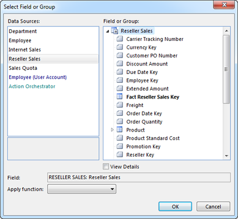
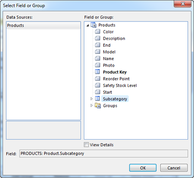
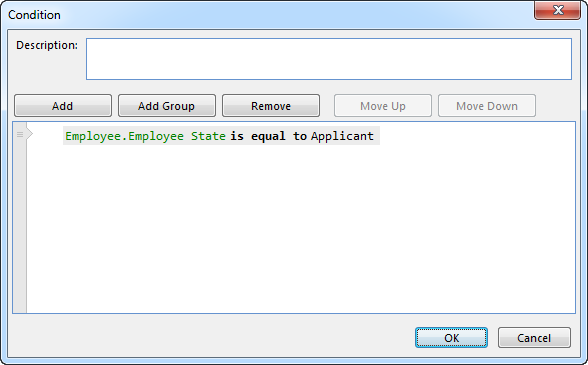
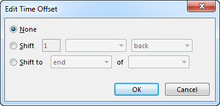
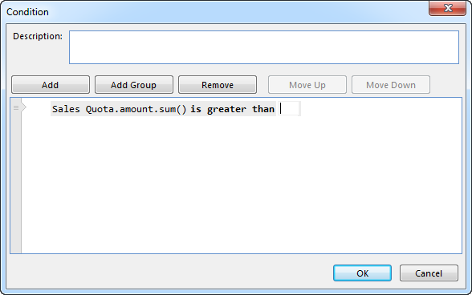
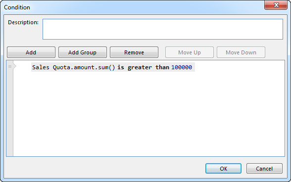

## Defining Operands

The condition editor allows you to use a wide range of operands. For more information on the meaning of the operands, see [Conditions](../../conditions.md).

**Field or Group**

A field or a group can be selected from the available data sources in the current context. A field represents a simple value or a reference to another object, and can be a single value or a collection ([bag](../../advanced-expressions/collection-types.md)) of values. A group represents a single object or a bag of objects.

To use a field or group as operand, right click the operand and click **Select Field or Group**.

The data sources that are available in the current context are listed to the left. Some can contain only one object and some can contain many objects. When a data source is selected, the available fields and groups for the data source objects are listed to the right. 

<table style="WIDTH: 100%">

<tbody>

<tr>

<td>

The data source Employee can hold one object. The Employee.Employee State therefore contains one value.

</td>

<td>

The data source Internet Sales can hold many objects. The Internet Sales.Product therefore contains a bag of Products.

</td>

</tr>

<tr>

<td>

The data source Reseller Sales can contain many objects.

</td>

<td>

The data source Department can contain one object, but the group Employee under Department can contain many objects.

</td>

</tr>

</tbody>

</table>

**Active User Account**

To access the object associated with the currently signed in user, or fields from this object, right click the operand and click **Select Field or Group**, and then in the list of data sources select a data source suffixed **(User Account)**. There can be several such data sources available if the application is defined to support sign in for different user groups (for example employees and customer contacts). The top level of a user account data source always contains one object.

**Active Object Selection**

A condition defined inside a [Table](../../../user-interface/tables/index.md) or a [Form](../../../user-interface/forms/index.md) can access data sources and fields based on Active Object Selection, which are objects selected by the user in the user interface.

To access an active object selection, right click the operand and click **Active Object Selection**.  

Click the **...** button after the **Group** box, and select data source or group.

Click **Single Selected Object** if the selection should only be valid if one object is selected, or click **Selected Objects** if one or more objects are acceptable.

To access a field for the active object selection, click the **...** button after the **Field** box, and select a field.

**Code Domain**

To select one code domain value, right click the operand and select a value in the list.

To select many code domain values, right click the operand and select **Object Selection**.

Select the values to include, and click **OK**.

**Lookup**  

A lookup finds objects based on a separate condition, and the result is used as an operand in the condition.

If you want find Internet Sales for a set of Territories, and you do not have a data source or group with the specific territories, you can use a lookup. Right click the operand and select **Look up object(s)**.

A new condition window appears where the condition for the look up objects you want to find can be defined.

When you select a field or group, a lookup specific data source is available.

When the lookup condition is completed, click OK.

The completed condition with a lookup.

**Time Function**

A condition may use fields containing time, and often you want to express comparisons to relative time; "Employees hired last month".

To use a Time Function, right click the operand, and select **Time Function**.

In the Time Function window, advanced functions for relative time can be defined.

Often the starting point for a time function is today, but you can use other dates in the **Time Reference** box.

In the **Time Function** window, click **Add** to add a time offset.

To shift time, click **Shift**, and specify how many days, months, etc to shift, and whether to shift back or forward.

  

To shift to the start or end of a period, click **Shift to** and specify whether to shift to the start or the end, and which period to use.

  

Click ok to add the offset to the time function. Several steps can be added to make advanced functions.

Click OK to finish the time function.

**Formula**

A formula can contain simple calculations or advanced functions. For more information on formulas, see [Advanced Expressions](../../advanced-expressions.md).

To use a formula, right click the operand, and select **Enter a formula**.

In the formula window, enter the formula to use, and click **OK**.

  

**Constant**  

A constant can be used as an operand when the data type for the other operand is a simple value.

To use a constant, right click the operand and select **Enter a number**, **Enter a text**, **Select a date**, etc, according to the date type of the operand.

If the constant data type is a date, in the **Select Date** window, select a date and click **OK**.

Otherwise, in the input field, enter the constant.

Click **OK**.

