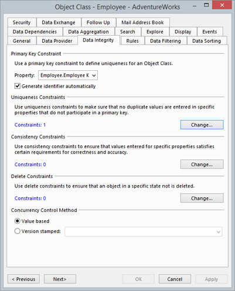

# Data Integrity

You can use Primary Key Constraint to define uniqueness for an Object. You can also define rules to ensure the accuracy of data and its conformity to its expected value by using uniqueness constraints, consistency constraints and delete constraints.

Two types of rules are supported:

*   **Notify user and cancel command**. Used to enforce rules for maintaining data integrity. A uniqueness constraint secures that not more than one object with a given set of key values exists. Any attempt to save an object which violates the constraint will be denied.
*   **Notify user and ask for confirmation to proceed**. Used to avoid that potential similar objects are registrered more than once. A uniqueness check does not prevent saving an object, but will inform the user of other objects which satisifies the requirements for the check. For example, you can use a uniqueness check to inform the user that a customer with the same name already exists.

## Primary Key Constraint

Uniqueness for an Object Class is defined by a primary key which uniquely identifies an object. A primary key or a unique key comprises a single property or a set of properties. Two objects can't have the same value (or combination of values) for those properties.

To define a Primary Key, do the following:

1.  In the **Primary Key Constraint** section, click **Change**.
2.  In the **Primary Key Constraint** dialog box, click **Add**.
3.  In the **Primary Key**dialog box, select property you want use as uniqueness for the object.
4.  In the **Type** section, click the type of your choice.  
    * Simple Primary Key comprises single property  
    * Composite Primary Key comprises a set of properties.
5.  Select the Generate identifiers automatically check box to let the system genereate identifiers for the key.  
    Note: This option is only available for properties with data type integer or string. A numeric key is generated as a sequential number that uniquely identifies an object. A text key is generated using a [GUID (Globally Unique Identifier)](../../../../../terminology.md "Globally Unique Identifier (GUID)"). The data size for the property must be at least 32 characters to store a GUID.

## Uniqueness Constraints

Use of Uniqueness constraints ensures you that no duplicate objects are entered in specific properties that do not participate in a primary key.

Add a Uniqueness Constraint, do the following:

1.  In the **Uniqueness Constraints** section, click **Change**.
2.  In the **Uniqueness Constraints** dialog box, click **Add**.
3.  In the **Impact** section, click a impact of your choice.  
    * [Notify user and cancel command](data-integrity.md "Data Integrity") will deny user to save an object which violates the constraint.  
    * [Notify user and ask for confirmation to proceed](data-integrity.md "Data Integrity") will not prevent user saving an object.  
4.  In the **If this condition is true** box, optionally set a [condition](../../../common-concepts/conditions/index.md "Conditions") that must be satisfied before the rule is evaluated. For example, you may only want to evaluate the rule for objects in a specific state.  
5.  In the **Then use this expression to check for existence of duplicate objects** enter a [condition](../../../common-concepts/conditions/index.md "Conditions") used to check for existence of duplicate objects.  
6.  In the **Screen Tip box**, type the text you want to display when a user points to a visual control associated with one of the properties included in the duplicate condition.  
    In the Message box, type the text to display in a dialog box, when one or more duplicate objects are found.
7.  Click **OK**.

The rule is added to the end of the list displaying all rules for the Object Class. The rules will be evaluated in the order shown. If the condition for a rule is satisfied and one or more duplicate objects were found, succeeding rules will not be evaluated. To change the evaluation order for a rule, click the rule in the list, and then click **Move Up** or **Move Down**.  

## Consistency Constraints

Use of Consistency Constraints ensures you that values entered for specific properties satisfied a certain requirements for correctness and accuracy.

To add Consistency Constraints, do the following:

1.  In the **Consistency Constraints** section, click **Change**.
2.  In the **Consistency Constraint** dialog box, click **Add**.
3.  In the **Impact** section, click the impact of your choice.  
    * [Notify user and cancel command](data-integrity.md) will deny user to save an object which violates the constraint.  
    * [Notify user and ask for confirmation](data-integrity.md) to proceed will not prevent user saving an object.
4.  In the **Condition** box, set a [condition](../../../common-concepts/conditions/index.md) that must be satisfied before the rule is evaluated.
5.  In the **Notification Message** box, type the text you want to display when the constraint is violated.
6.  Click **OK.**

The constraint is added to the end of the list displaying all consistency constraints for the Object Class. The constraints are evaluated in the order shown. If the condition for a constraint is satisfied, succeeding constraints will not be evaluated. To change the evaluation order for a constraint, click the constraint in the list, and then click **Move Up** or **Move Down**.  

## Delete Constraints

You can define a special set of rules or constraints used for restricting access to delete an object. A Delete Constraint is defined by specifying a condition which expresses a state for an object which not can be deleted. You can add multiple delete constraints to an Object Class.

To add Delete Constraints, do the following:

1.  In the **Delete Constraints** section, click **Change**.
2.  In the **Delete Constraints** dialog box, click **Add**.
3.  In the **Impact** section, click the impact of your choice.  
    * [Notify user and cancel command](data-integrity.md) will deny user to save an object which violates the constraint.  
    * [Notify user and ask for confirmation to proceed](data-integrity.md) will not prevent user saving an object.
4.  In the **Condition** box, enter a [condition](../../../common-concepts/conditions/index.md) which expresses the state for an object which not can be deleted.
5.  In the **Notification Message**, type a message explaining why the permission to delete an object has been denied. The message is displayed to the end user if the condition for the constraint is satisfied.
6.  Click **OK**.  

    The constraint is added to the end of the list displaying all delete constraints for the Object Class. The constraints are evaluated in the order shown. If the condition for a constraint is satisfied, succeeding constraints will not be evaluated. To change the evaluation order for a constraint, click the constraint in the list, and then click **Move Up** or **Move Down**.  

## Concurrency Control Method

The two available methods for performing concurrency control, when updating data in the database, are Value Based and Version Stamped. The common concept is that everyone can read the same object from the database, and before updating the object, the information that was read is checked against the the database. If the information is changed since it was read, an update is not allowed. If the information is unchanged, the update is performed.

**Value Based** concurrency control checks if the value of each individual property is changed. If more than one property is updated at the same time, the values for all the properties are checked at the same time. If any one of the values have changed since they were read, the updated is aborted for all properties. If two concurrent updates are performed on non-overlapping sets of properties, these updates are allowed.

**Version Stamped** concurrency control uses a dedicated version property to check for changes to the object. The dedicated version property is stamped with a new version whenever any part of the object is updated. Before an update of any property is performed, the stamped version is checked for changes. If the version has changed, the object is updated by another user or process, and the update is aborted. If the version has not changed, the update is performed and the object is again stamped with a new version. If two concurrent updates are performed on non-overlapping sets of properties, the last update is aborted. The version property can either be, a unique identifier which is stamped with a new GUID, or an integer which is stamped by increasing the value.

