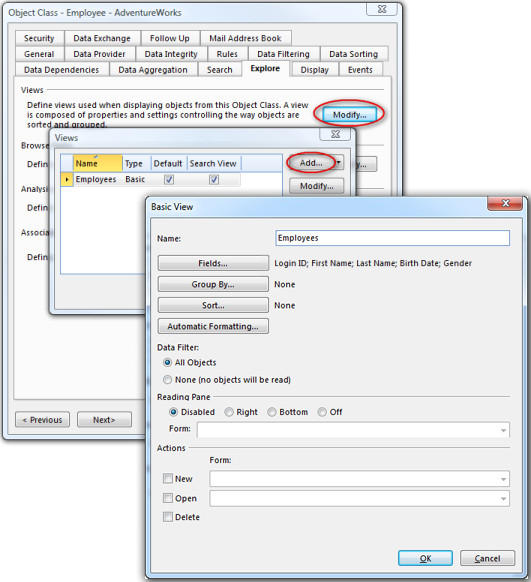
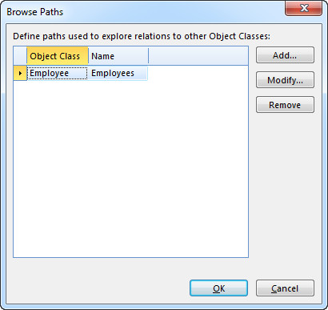

# Explore

## Views

Define views used when displaying objects from Object Class. A view is composed of properties and settings controlling the way objects are sorted and grouped. To set a view to be the default view for the object class, select the **Default** check box. Only one view can be set as default, but you can re-use a view from a table as the default view. You can also [create shortcut](../../../user-interface/navigation-pane.md "Add a Shortcut to a View Button, Group or Folder") for the basic views. To allows user to search in the Data Source with the basic view, select **Search View** check box.

### Basic View

To add Basic View, in the **View** section, click **Modify** and click **Add**.

| Property                       | Description |
|--------------------------------|-------------|
| Name                           | The display name for the view. |
| Fields                         | Choose which fields to display in the view. |
| Group By                       | Choose which fields to group by. A group is a set of objects with common attribute. |
| Sort                           | Sort objects by one or more columns. |
| Automatic Formatting           | Visualize specific aspects of the data. See also, [Automatic Formatting](../../../common-concepts/automatic-formatting.md "Automatic Formatting"). |
| **Data Filter**                | |
| All Objects                    | Display all objects in the view. For more advanced configuration of data filter, you have to use Table View and define table with one or more views. |
| None (no objects will be read) | Display none objects in the view. |
| **Reading Pane**               | | 
| Disabled                       | A reading pane is not available in the view. |
| Right                          | Display a reading pane to the right in the view. |
| Bottom                         | Display a reading pane at the bottom in the view. |
| Off                            | A reading pane is available in the view, but it is not visible by default. |
| Form                           | Choose the form to be used as reading pane. |
| **Actions**                    | |
| New                            | Allows user to open a form where the user can fill out and save data for an object. You have to specify which form to open. |
| Open                           | Allows user to open the object in a form by double-click an object. The user can modify and save data for an object. You have to specify which form to open. |
| Delete                         | Allows user to delete. |

### Table View

A Table View is a view defined in Table. The table view can be re-used for the object class, for example as a default view. **** 

1.  To add Table View, in the **View** section, click **Modify** and click  on **Add** button.

2.  Click **Browse** to select a table.

3.  Click down arrow in the **View** field and select a view.

For more information about defining views in tables, see the article about [Views](../../../user-interface/tables/views.md "Views") in a Table.

## Browse Paths

Object Classes in your directory describes a structured collection of interrelated data. Relations between objects are described by properties referring to objects in other Object Classes. **Browse paths** allows the user explore these relations from the **Explore** menu in forms, tables and reports.

To add a browse path, do the following:

1.  Click **Add**.  
    
2.  In the **Name** box, type a name for the path.  
    
3.  To define a path, click **Modify**.
4.  A path condition defines the path from one object class to another, via other object classes if necessary. The step between two object classes is defined by conditions between the properties of the two object classes. For further information see [path conditions](#path-condition "Path Condition").
5.  In the **View** list, select the view to use for displaying the objects found using this browse path.
6.  Click **OK**.
7.  Click **OK**.

## Path Condition

A path condition defines the path from one object class to another, via other object classes if necessary. The step between two object classes is defined by conditions between the properties of the two object classes. In database terms this would be referred to as "a join" between two object classes.

To add a step in the path condition, do the following:

1.  The current object class in the path is shown on the left, and the operator in the middle box is *Join with*. To select the object class to join with in the box on the right, do this:
2.  Click the down arrow and then click **Select Field or Group**.  
    
3.  In the list, select the correct object class.
4.  In the immediately followin **By** section, define the condition between the two object classes. To enter conditions for more than one set of proerties, click **Add>>**. For more information on defining conditinos see [Conditions](../../../common-concepts/conditions/index.md "Conditions").  
5.  If the path condition is finished, click **OK,** then click **OK,** then click **OK.**
6.  Or, to add another step in the path, click **Click to modify the right side of join**.
7.  Repeat from 1)

## Report Links

A link to a Report is defined by specifying a data filter for the data sources provided by the Report. The objects selected by users in a table or form are sent as input when the linked is opened. These objects can be used for filtering the data sources provided by the Report, and gives you the opportunity to define context sensitive links.

The links to reports defined here, are displayed in the Report **Task Pane** and available for [distribution](../../../logic/action-orchestration/actions/effects/distribution-of-reports.md "Distribution of Reports"). You may also display links to a report from other places, like tab sheets in a Form and shortcuts in the Navigation Pane. See [Edit Report Links](../../../../how-to/exchange-data-with-other-applications/edit-report-links.md "Edit Report Links") for more information.

Follow these steps to create an Report Link in the Report **Task Pane**:

1.  In the **Report Links** section, click **Modify**.
2.  Click **Add**, and then select an Report.
3.  Follow the instructions in the [step-by-step procedure](../../../../how-to/exchange-data-with-other-applications/edit-report-links.md "Edit Report Links") on how to edit a Report Link.

## Associated Object Classes

Unlike browse paths, **Object Class associations** describes a more loosely coupled relationship between two Object Classes. That is, an association does not have to imply a direct connection between the objects in the two Object Classes. For example, in a temporary staffing system recording requests for temporary personell, you need to quickly search, match and place employees with the right jobs. If the request contains information about required qualifications and competence, you can associate the request with employees using qualifications and competence as a criterion.

Like browse paths, Object Class associations are available to users from the **Explore** menu in forms, tables and reports.

To add a new association, do the following:

1.  In the **Associated Object Classes** list, click **Add**.
2.  In the **Associated Object Class** box, select the Object Class which you want to associate.
3.  Type a name in the **Name** box.
4.  In the list below, associate properties and connections in the Object Class (**Base Property**) with a property or connection in the associated Object Class (**Associated Property**).
5.  In the **Data Filter** box, click **Modify** to specify a data filter for the associated Object Class. In the **Data Filter** dialog box, specify a [condition](../../../common-concepts/conditions/index.md) for restricting which objects to associate. In the example above, you would typically match the request with employees which not are absent or quitted.

The following rules applies for associating properties and connections:

*   Available **Base Properties** are restricted to properties with a complex data interpretation and connections.
*   If the **Base Property** is a property, the **Associated Property** has to be a property.
*   If the **Base Property** is a connection, the **Associated Property** can be either a property or a connection.
*   The data interpretation for the **Base Property** and the **Associated Property** has to be the same.

## Show in Recent Items

Select this option to allow objects for this concept to appear in the recent items list.

## Default Form

The default form is used whenever an object is opened and a form is not specified in the context.

To define the default form, in the **Default Form** box select a form. The default view in the form is used.

It is only possible to select a form with a data source based on the object class, where the data source can contain only one object, and is set as Is Master. The **Master Data Soure** **** box displays this data source from the selected form.

Currently this setting is only applicable when opening an object through a shortcut, for example from the navigation pane, an e-mail, or the desktop.

