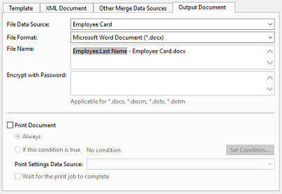

# Merge Data to a Document

In the **Name** box, optionally type a name. The name is displayed in the action tree, if a name is not entered, a summary of the effect is displayed.

In the **Description** box, optionally type a description.

In the **Template** tab, specify the document **File Format** (i.e. merging to Microsoft Word or Excel) and choose whether to read the template from an **Embedded File**, a **File Data Source** or a **File Data Field**.

It is generally *not recommended to use **Embedded File**, since this will increase the size of your local application model cache file, which may lead to increased startup time for Genus Desktop and Genus Services.*

The **XML Document** tab displays a preview of your XML Document. You may use this as a source for copying field names to your Word template or Excel template.

The **Other Merge Data Sources** tab allows you to add reports and Excel files as merge data sources in addition to data in your XML document. Such data sources do *not need to be defined in your XML document. Select a report or Excel file in the list, and click **Modify** to change data filters.*

To copy a merge data source, righ-click in the list and in the menu click **Add a Copy**. This is useful if you want to use the same report or Excel file multiple times but with different filters.

Note that report and Excel files as merge data sources apply to merging data to Word documents and not to Excel documents.

In the **Output Document** tab specify the output **File Data Source**, the **File Format** and the **File Name**. If the data source is an report, and the file format is an image, the size of the image is determined by the report [Page Setup](../../../../../../users/analyze-report-and-discover/report/save-to-file-or-print-a-report.md).

In the **File Name** box you may insert fields from your data sources to create dynamic file names. To insert a field, right-click inside the **File Name** box, and in the menu click **Insert Field**.

**Encrypt with Password**. You can protect the document by using a password to help prevent unauthorized access. Password protection is supported for the following file formats: *.docx, *.docm, *.dotx, and *.dotm.

Select the **Print Document** check box if you want to automatically print the merged document. You may specify a condition, which simplifies your setup in case you want to give your users several options (save to file, print, open). Select a **Print Settings Data Source** to apply any printer settings, these settings can for example have been input from the user in an earlier step.

To prevent that succeeding effects are executed before the print has finished, select the **Wait for the print job to complete** check box. This can be useful to ensure that the documents are printed in the correct order, if there are many consecutive merge effects. The performance can be affected when this option is selected.

For more information , see [Merge Data to a Microsoft Excel Document](../../../../../how-to/merge-data-to-a-document/merge-data-to-a-microsoft-excel-document.md) and [Merge Data to a Microsoft Word Document](../../../../../how-to/merge-data-to-a-document/merge-data-to-a-microsoft-word-document.md).
