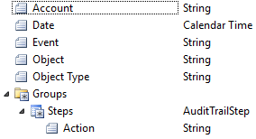

# The event history data source

The event history data source provides all information stored in audit trails for different types of events.



Detailed information for an audit trail is stored as steps with an action which describes the event. Below is an example of an audit trail for a modify event where the value for two properties have been changed:

```json
{
    "Date": "2017-12-20T10:25:28",
    "Event": "Modified",
    "ObjectType": "Person",
    "Object": "John Doe",
    "Account": "Jane Doe",
    "Steps": [
        {
            "Action": "Modified value for field Person.Bank Account from '<blank>' to '1111.11.11111'."
        },
        {
            "Action": "Modified value for field Person.State from 'Candidate' to 'Engaged'."
        }
    ]
}
```

A typical usage of the event history data source is to provide persons with a copy of all personal data a company stores about them (as imposed by the EU's General Data Protection Regulation). Data can be read into the event history data source by using a [read objects](../actions/effects/read-objects.md) effect.