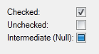

# Button controls

The button controls are used for receiving mouse operations, like a click, to initate actions or change data.

See [Common Control Properties](common-control-properties.md), in addition to the control specific properties below.

## Button

A standard clickable button.

The typical usage for a button is to assign an [event](../../events.md) to perform a [command](../../commands.md) when it is clicked.

Property              | Description
----------------------|----------------------
Disabled Screen Tip   | If the button is not enabled, this is the screen tip which is displayed when the mouse cursor is moved over the button.  Enter a text in the box, or click the "..." button in the box to select a field.  There are various ways the button can be disabled, for example if there are no events that are currently enabled, or if the parent group is not enabled.
Is Default            | The button is activated when the ENTER key is pressed in the form. Only one button in the form should have this option enabled.
Is Cancel             | The button is activated when the ESC key is pressed in the form. Only one button in the form should have this option enabled.
Symbol - Source       | Specify a symbol to display on the button.
Symbol - Color        | Specify the color of the symbol to display on the button.

## Check box

A box to represent an option that can be clicked to display a checkmark or not.

Can be bound to a field of type Boolean.

Property     | Description
-------------|--------------
Allow Null   | Determines if the control allow null values or not. If it does, the control offers a three-state operation(checked, unchecked, and itermediate):   

## Radio button

The radio button control displays a set of items as radio buttons which allows only one item to be selected at the time.

The control supports both data binding types

*   Value: the control can be bound to a field that references other objects
*   Object: the control can be bound to a data source

Property          | Description
------------------|------------------
Data Filter       | Filters the data for the control.  <ul><li>For data binding type Object, the data binding data source is filtered.</li><li>For data binding type Value, the data source referenced by the data binding field is filtered.</li></ul>
Default Selection | Defines which item that is selected initially. Only applicable for data binding type Object.  <ul><li>**None** - No item is selected</li><li>**Mark First Item** - The first item is selected.</li><li>**Condition** - A condition defines which item is initially selected.</li></ul>
Display Value     | A field in the data source to display as the value in the list.
Orientation       | The orientation to prioritize when displaying items.  <ul><li>**Horizontal** - The items are displayed from left to right, then top to bottom.</li><li>**Vertical** - The items are displayed from top to bottom, then left to right.</li></ul>
Sort Order        | Sort the list by display value  <ul><li>**None** - Do not sort.</li><li>**Ascending** - Sort alphabetically ascending.</li><li>**Descending** - Sort alphabetically descending.</li></ul>

## Track bar

The track bar is a scrollable control which is used to slide a small thumb along a continuous line to change the value. It also supports a range style with two thumbs for a start and end value. A track bar can be oriented horizontally and vertically, and can also be manipulated with the keyboard.

The control data bindings can be bound to properties of data type integer or real.

Property                 | Description
-------------------------|--------------------------------
Data Binding - End       | A [data binding](../../../../../../users/search-and-refine/data-binding.md "Data Binding") that defines the end of the range. Only applicable if Style is Range.
Data Binding - Start     | A [data binding](../../../../../../users/search-and-refine/data-binding.md "Data Binding") that defines the start of the range. Only applicable if Style is Range.
Large Step               | The number of ticks to move the thumb if <ul><li>pressing the PAGE UP or PAGE DOWN keys</li><li>clicking on the track bar line on either side of the thumb, if the Move To Point option is disabled.</li></ul>
Max Value                | The maximum value for the track bar.
Min Value                | The minimum value for the track bar.
Move To Point            | Allow the user to click anywhere on the track bar line to move the thumb to this point.
Orientation              | <ul><li>**Horizontal** - The track bar is oriented from left to right.</li><li>**Vertical** - The track bar is oriented from top to bottom.</li></ul>
Show Step Buttons        | A button is displayed on each end of the track bar. These can be used to change the value.
Small Step               | The number of ticks to move the thumb if<ul><li>pressing one of the arrow keys</li><li>clicking on one of the step buttons.</li></ul>
Style                    | <ul><li>**Native** - The trackbar has one thumb to modify one value.</li><li>**Range** - The trackbar has two thumbs, which can be operated independently, and thereby defines a range.</li></ul>
Tick Frequency           | A tick is displayed for every n positions, if tick placement is not set to None. For example, a tick frequency of 10 displays 11 ticks for a trackbar from 0 to 100.
Tick Placement           | <ul><li>**None** - No tickmarks are displayed.</li><li>**Top Left** - Tickmarks are displayed above the line for horizontal orientation, or to the left for vertical orientation.</li><li>**Bottom Right** - Tickmarks are displayed below the line for horizontal orientation, or to the right for vertical orientation.</li><li>**Both** - Tickmarks are displayed on both sides.</li></ul>

