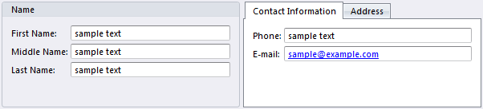

# Tab Sheets

Tab sheets can can contain several group controls, and displays a tab for each of them. One tab is active at a given time, and the corresponding group is displayed with its content.

To remove a tab sheet, select the tab, and press DELETE. To change the order of the tab sheets, right click one of the tabs, and click **Sort Tab Sheets**. To add a new tab sheet, select the tab sheets control and then double click the Group control or the Group Box control in the control pane. To modify the content of a tab sheet, select the tab, and then select the group in the tab sheet.

## Properties

See [Common Container Properties](common-container-properties.md) and [Common Control Properties](../common-control-properties.md), in addition to the control specific properties below.

Property                    | Description
----------------------------|--------------------------------
Tab Location                | The tabs are displayed along one of the sides within the control: **Top**, **Bottom**, **Left**, or **Right**.
Tab Orientation             | The orientation of the tabs and their caption.  <ul><li>**Horizontal** - Tab and caption is displayed horizontally, which is most easily readable on screen, but takes up much space for tabs located at the top or bottom.</li><li>**Vertical** - Tab and caption is rotated 90 degrees in either direction, depending on the Tab Location setting. This option can save space horizontally, but may be more difficult to read.</li></ul>  This option is only available for multi line tab style.
Tab Style                   | Specifies how tabs are arranged when the total width or height of them exceeds that of the control.  <ul><li>**Multi Line** - If there are too many tab headers to fit on a single line, the headers are arranged in multiple lines. As a result, all tab headers are displayed on the screen.</li><li>**Single Line** - If there are too many tab headers to fit, scroll buttons are displayed. As a result, all tab headers can be made available by scrolling to the tabs that are not currently visible.</li></ul>
Allow Set Default Tab Sheet | Allows individual users to specify which tab sheet is default active when opening the form. If enabled, the users can right click on any of the tabs and select **Set as Default**.
