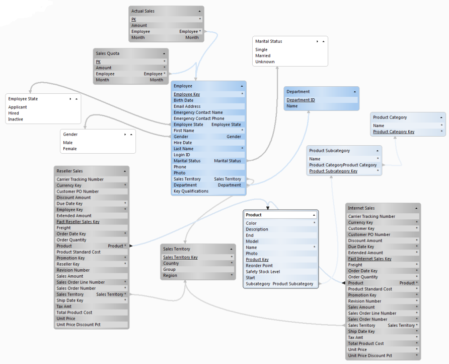

## Object Class Diagram

Optimal database design is a key component of any application development effort. A well aligned information architecture is just as critical and can only be realized with clearly documented metadata. The **Object Class Diagram** addresses both requirements by allowing you to visualize and maintain your object model. It also promotes effective communications between the various stakeholders of your application, and enables you to address design issues and concerns prior to any significant resource investments.

The Object Class Diagram helps you manage large object models through **pages**, dividing the model into smaller, manageable subsets. On each page you can insert Object Classes already existing in your Directory, or draft new classes and properties.

Bi-directional synchronization of the object model and the database is supported through **reverse- and forward engineering**. Reverse engineering helps you to identify, assess and manage changes between the object model and the database via synchronization of database tables and columns. As the model is changed, you can propagate the changes to the database by automated SQL-script generation provided by the forward engineering functionality.

## How to Open the Object Class Diagram

1.  [Open Genus Studio](../getting-started/how-to-open-genus-studio.md).
2.  In the **Directory Tree**, click the **Object Classes** folder.
3.  On the status bar at the lower right-part of the window, click **Diagram**.

## Add, Rearrange, Delete and Rename Pages <a name="add-rearrange-delete-and-rename-pages"/>

Pages gives you the opportunity to divide your object model into smaller, manageable subsets. By default, an empty diagram contains a single page named **Master**. The Master page contains all Object Classes and drafts defined in your Directory.

**Add a New Page**

To quickly insert a new page at the end of the existing pages, do the following:

1.  Click the **New Page** tab.
2.  In the **New Page** dialog, type a name for the page.
3.  Click **OK**.

To insert a new page in front of an existing page, do the following:

1.  Right-click the tab for the existing page, and then click **Insert Page** on the shortcut menu.
2.  In the **New Page** dialog, type a name for the page.
3.  Click **OK**.

**Rearrange the Order of Pages**

1.  Right-click a **page** tab, and then click **Sort Pages** on the shortcut menu.
2.  In the **Page Order** list, click the page you want to move, and then click **Move Up** or **Move Down**.
3.  Click **OK**.

**Delete a Page**

Right-click the tab for the pageyou want do delete, and then click **Delete** on the shortcut menu.

**Rename a Page**

1.  Right-click the tab for the page you want to rename, and then click **Rename** on the shortcut menu.
2.  In the **Rename Page** dialog, type a name for the page.
3.  Click **OK**.

## Change the Style for Connectors on a Page

A connector is a line which connects two shapes in your diagram. A connector is drawn if one shape has an outbound reference to another shape. For example, if the Object Class _Contact Person_ is part of _Customer_, that is, _Contact Person_ has an outbound reference to _Customer,_ a connector is drawn between the two shapes. The arrow at the endpoint of a connector indicates if it is an outbound- (_Contact Person_) or inbound reference (_Customer_).

You can change the look of the connectors by changing the line style and the connection style:

1.  Right-click the page, and then in the shortcut menu, click **Format Page**.
2.  In the **Line Style** box, select either curved or straight lines.
3.  In the **Connection Style** box, select a connection style: **Property** (connectors are drawn from properties with outbound references), **Class Top & Bottom** (connectors are drawn from the top and bottom of the shape, inbound and outbound references are drawn with separate endpoints for inbound and outbound references) or **Class All Sides** (connectors are drawn from all sides of the shape).

To change the default format settings used for new pages, do the following:

1.  In the **Tools** menu, click **Diagram Options**.
2.  Click the **Page** tab.

## Add Object Classes to a Page

1.  Right-click the page. In the shortcut menu, point to **Insert** and then click **Object Classes**.
2.  In the **Available Classes** list, select which Object Classes you want to insert, and then click **Select**.
3.  To remove a selected Object Class, in the **Selected Classes** list, click the Object Class, and then click **Remove**. Note that Object Classes already added to a page are displayed in the **Selected Classes** list.
4.  Click **OK**.

**Insert Outbound- or Inbound Object Classes for an Object Class**

An Object Class (A) has an outbound reference to Object Class (B) if (A) contains a property where the data interpretation for the property equals (B). For example, if the Object Class _Department_ has a property _Manager_ with a data interpretation equal to _Employee_, then _Department_ has an outbound reference to _Employee_.

An Object Class (A) has an inbound reference to Object Class (B) if (B) contains a property where the data interpretation for the property equals (A). In the example above, _Employee_ has an inbound reference from _Department_.

To insert outbound- or inbound Object Classes for an Object Class on a page, do the following:

1.  Right-click the Object Class which you want to insert outbound- or inbound Object Classes for. In the shortcut menu, point to **Insert**, and then click **Outbound Object Classes** or **Inbound****Object Classes**.
2.  Click **Select All** to select all Object Classes, or in the **Available Classes** list, select which Object Classes you want to insert, and then click **Select**.
3.  Click **OK**.

For example, to quickly build a star schema, insert the fact Object Class of interest, and then insert all outbound references from the fact Object Class to the dimension Object Classes.

## Add a Draft Class to a Page

Drafting of classes is a powerful means to create a low-cost collaborative graphical design of your model. Bi-directional synchronization of drafts are supported through forward- and reverse engineering.

To add a draft class, do the following:

1.  Right-click the page. In the shortcut menu, point to **Insert** and then click **Class (Draft)**.
2.  In the **Logical Name** box, type the name for the class.
3.  In the **Physical Name** box, type the RDMS table name for the class.
4.  Optionally type a description in the **Description** box.

## Replace a Draft with an Object Class

1.  Right-click a page or the draft which you want to replace, and then in the shortcut menu click **Replace Draft**.
2.  In the **Draft** box, select the draft which you want to replace.
3.  In the **Replace with** box, select an Object Class.
4.  Select the **Copy descriptions from draft** checkbox if you want to copy descriptions from the draft to the Object Class. Properties are matched by physical name.

The draft is replaced with the selected Object Class on all pages containing the draft, and outbound references in other classes to the draft are replaced with an outbound reference to the Object Class.

**Note!** The draft is permanently deleted from the diagram.

## Add a Draft Property to a Class

1.  Right-click the draft- or Object Class which you want to add a property to. In the shortcut menu, point to **Insert** and then click **Property (Draft)**.
2.  In the **Logical Name** box, type a name for the property.
3.  In the **Physical Name** box, type the RDBMS column name for the property.
4.  If the property is an outbound reference to another class, select the class in the **Outbound Reference** box. The data type is automatically filled out with the data type for the primary key in the outbound class. If the property not is an outbound reference, in the **Data Type** box, type a data type.
5.  Optionally enter a description in the **Description** box.
6.  Select the **Primary Key** check box if the property is a primary key.
7.  I f a value for the property is required, click to clear the **Allow Nulls** check box.

**Tip**. To quickly insert a draft property, click to select a shape and then press CTRL+PLUS.

**Tip**. To quickly insert a property with an outbound reference to another class, click to select the shape for the outbound class, press ALT, and then drag the outbound class to the class where you want to insert the property.

**Tip**. To copy a property from another class, right-click the property which you want to copy, and then in the shortcut menu click **Copy**. Right-click the class you want to copy the property to, and then in the shortcut menu click **Paste**.

## Hide or Unhide a Property in a Class

To hide a property, do the following:

*   Right-click the property. In the shortcut menu point to **Hide** and then click **Property**.

To unhide a hidden property, do the following:

*   If hidden properties not are displayed, right-click the class, and then in the shortcut menu, click **Format Shape**. In the **Format Shape** dialog box, select the **Hidden Properties** check box in the **View** section. Click **OK**.
*   Right-click the hidden property. In the shortcut menu point to **Unhide** and then click **Property**.

You can also hide and unhide properties of a specific type:

*   Right-click the draft- or Object Class which you want to hide or unhide properties for. In the shortcut menu, point to **Hide** or **Unhide,** and then click a property type.
*   You can hide or unhide properties of the following types: **Auditing Properties**, **Function Properties**, **Primary Keys** and **Reference Properties**.

**Tip**. You can hide or unhide more than one property in a single operation in the **Property** section in the **Format Shape** dialog box (right-click the shape, and then in the shortcut menu, click **Format Shape**).

## Hide or Unhide an Outbound Connector from a Class

A connector is a line which connects two shapes in your diagram. A connector is drawn if one shape has an outbound reference to another shape. In some cases you may not want to draw connectors for all outbound references.

To hide an outbound connector for a property, do the following:

*   Right-click the property. In the shortcut menu point to **Hide** and then click **Outbound Connector**.

To unhide a hidden outbound connector, do the following:

*   Right-click the property. In the shortcut menu point to **Unhide** and then click **Outbound Connector**.

**Tip**. You can hide or unhide more than one connector in a single operation in the **Property** section in the **Format Shape** dialog box (right-click the shape, and then in the shortcut menu, click **Format Shape**).

## Change the Display Order for Properties in a Class

*   Click to select a property, and then press SHIFT+ALT+UP or SHIFT+ALT+DOWN.

## Add a Text Box to a Page

1.  Right-click the page. In the shortcut menu, point to **Insert** and then click **Text Box**.
2.  In the **Text** box, type a text.
3.  Click **OK**.

## Copy or Move Shapes between Pages

1.  Select the shapes which you want to copy or move.
2.  In the **Edit** menu, click **Copy** to copy the selected shapes, or **Cut** to move the selected shapes.
3.  Click the tab for the page you want to copy or move the shapes to.
4.  In the **Edit** menu, click **Paste**.

**Note.** You can not move Object Classes from the master page to another page.

## Delete or Remove Shapes

To remove one or more shapes from the current page, select the shapes which you want to remove, and the press DELETE.

To permanently delete the selected shapes, press SHIFT+DELETE. When a shape is permanetly deleted, the shape is deleted from the master page and all other pages in your diagram.

**Note.** If you delete a shape on the master page, the shape is permanently deleted.

## Format a Shape

Right-click the shape you want to format, and then in shortcut menu, click **Format Shape**. The formatting options available for the different types of shapes are described in the table below.

<table style="WIDTH: 100%">

<tbody>

<tr>

<th>

Option

</th>

<th>Description</th>

<th>Applies to Shapes of Type</th>

</tr>

<tr>

<td>Fill Color</td>

<td>Changes the background color for the shape</td>

<td>All shapes</td>

</tr>

<tr>

<td>Naming</td>

<td>

Alternates between physical and logical naming for a class.

**Tip**. To quickly alternate the naming for a class, press CTRL+2.

</td>

<td>Draft class, object class</td>

</tr>

<tr>

<td>View - Properties</td>

<td>

Hides or unhides properties.

**Tip.** To quickly hide or unhide properties, click the arrow in the upper-right corner of the shape.

</td>

<td>Draft class, object class</td>

</tr>

<tr>

<td>View - Hidden Properties</td>

<td>

Hides or unhides hidden properties.

**Tip.** To quickly hide or unhide hidden properties, press the key combination ALT+SHIFT+PLUS or ALT+SHIFT+MINUS**.**

</td>

<td>Draft class, object class</td>

</tr>

<tr>

<td>View - Data Type for Properties</td>

<td>Hides or unhides the data type for properties.</td>

<td>Draft class, object class</td>

</tr>

<tr>

<td>View - Description</td>

<td>Hides or unhides the description. The description is displayed in a text box below the shape.</td>

<td>Draft class, object class, container</td>

</tr>

</tbody>

</table>

You can apply graphics formatting, such as fill color, by copying formatting from one shape:

1.  Select the shape that has the formatting that you want to copy.
2.  In the **Edit** menu, click **Copy**.
3.  Select the shapes that you want to format, and then in the **Edit** menu, click **Paste Format**.

To change the default format settings used for new shapes, do the following:

1.  In the **Tools** menu, click **Diagram Options**.
2.  Click the **Shape** tab.

## Group Shapes in a Container

Containers allows you to group shapes, such as Object Classes within a composition. To group a set of shapes, do the following:

1.  Begin by selecting the first shape you want to place in the container. Press CTRL, and click on additional shapes you want to group together. When you are done, right-click on the page. In the shortcut menu, point to **Insert** and then click **Container**.
2.  In the **New Container** dialog box, type a name and description for the container.

If you want to place additional shapes in the container, simply drag the shapes into the container. To remove a shape from a container, drag the shape outside the container.

**Tip.** To quickly group selected shapes in a new container, press CTRL+G.

## Zoom In or Out of a Page

You can zoom in to get a close-up view of a page, or zoom out to see more of a page at a reduced size.

To chooze a particular zoom setting, do the following:

*   On the status bar, click **Zoom** **.**
*   In the **Zoom** dialog box, enter a percentage or choose one of the predefined zoom settings.

To zoom the page to 100% of the normal size, do the following:

*   On the status bar, click **Zoom 100%** ****.

To zoom the page so that all shapes fits in the window, do the following:

*   On the status bar, click **Zoom to Whole Page** ****.

## View the Diagram in Full Screen View

On the status bar, click **Slide Show** **.**

The current page is displayed in full screen view. To page through the diagram, click the arrows?in the upper-right corner of the window. To turn off full screen view, click Close in the upper-right corner of the screen, or press ESC.

## Forward Engineering

Using the **Forward Engineering Wizard**, you can propagate changes in your model to the database by automated SQL-script generation.

*   In the **Actions** menu, click **Forward Engineering**.
*   Select which classes you would like to script. To add one or more class, press CTRL and click the classes in the **Available Classes** list, and then click **Select**. To remove one or more selected classes, press CTRL and click the classes in the **Selected Classes** list, and then click **Remove**. To select or remove all classes, click **Select All** or **Remove All** respectively. You can filter the types of classes to display by selecting the **View** check boxes below the **Available Classes** list.
*   Click **Next**.
*   Choose which SQL-statements you would like to include in the script and the vendor version for the database where you are planning to run the script. By default the database vendor version for your Directory is selected.
*   Click **Next** to generate the SQL-script.
*   To copy the script to the clipboard, click **Copy to Clipboard**. To save the script to a file, click **Save to File**.
*   Click **Finish**.

## Reverse Engineering

Using the **Reverse Engineering Wizard**, you can identify, assess and manage changes between your object model and the database via synchronization of database tables and columns. New tables and columns are added as draft classes and properties. Changes made to columns associated with a property in your diagram are only applied to draft properties. Object Class properties are not affected by reverse engineering.

*   In the **Actions** menu, click **Reverse Engineering**.
*   In the **Logical Database** box, select the logical database you would like to reverse engineer. If your Directory contains more than one data set, in the **Data Set** box, select which data set to access when reading the database dictionary.
*   Click **Next**.
*   Select which tables you would like to reverse engineer. To add one or more table, press CTRL and click the tables in the **Available Tables** list, and then click **Select**. To remove one or more selected tables, press CTRL and click the tables in the **Selected Tables** list, and then click **Remove**. To select or remove all tables, click **Select All** or **Remove All** respectively. Tables not found in your diagram are identified as _New Table_ in **Available Tables** list. Tables found in your diagram are identified as either _Draft_ or _Object Class_. You can filter the types of tables to display by selecting the **View** check boxes below the **Available Tables** list.
*   Click **Next**.
*   On the options page, specify how to synchronize the diagram with the selected database tables:

<table style="WIDTH: 100%">

<tbody>

<tr>

<td>**New Tables**</td>

<td>Add shapes to the current page or the master page only.</td>

</tr>

<tr>

<td>**New Table Columns**</td>

<td>Map foreign keys by name.</td>

</tr>

<tr>

<td>**Deleted Table Columns**</td>

<td>Remove property or mark property as deleted.</td>

</tr>

</tbody>

</table>

*   Click **Next**.
*   Review your selections to verify that you are extracting the information you want. Click **Finish**.

## Insert Shapes as a Picture in a Document

If you want to insert shapes as a picture in a document, for example in a spreadsheet or a text document, you can simply copy the shapes and paste them as a picture in the document.

1.  Select the shapes you want to include in the picture. To select all shapes on a page, right-click the page, and then in the shortcut menu, click **Select All**.
2.  In the **Edit** menu, click **Copy**.
3.  In the document, click where you want to insert the picture, and then in the **Edit** menu, click **Paste**.

## Keyboard Shortcuts

Keyboard shortcuts available in the Object Class diagram are described in the article [Keyboard Shortcuts for Genus Desktop Client](../user-interface/keyboard-shortcuts.md).

