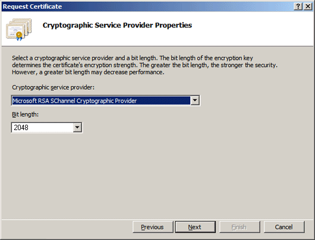
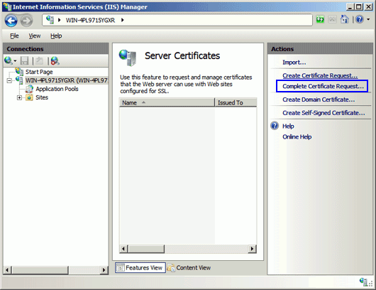
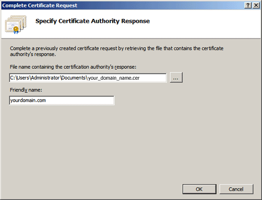

## Create a Web Server Certificate

Creation of a Web Server Certificate involves creating a request, sending it to the applicable authority and receiving the response before assigning it.

## Step 1 - Create a Certificate Request

1.  Click Start, then Administrative Tools, then Internet Information Services (IIS) Manager.  

2.  Click on the server name.  

3.  From the center menu, double-click the "Server Certificates" button in the "IIS" section (near the bottom of the menu).  

      

4.  Next, from the "Actions" menu (on the right), click on "Create Certificate Request." This will open the Request Certificate wizard.  

      

5.  In the "Distinguished Name Properties" window, enter the information as follows:  
    **Common Name** - The name through which the certificate will be accessed (usually the fully-qualified domain name, e.g., www.domain.com or mail.domain.com).  
    **Organization** - The legally registered name of your organization/company.  
    **Organizational unit** - The name of your department within the organization (frequently this entry will be listed as "IT," "Web Security," or is simply left blank).  
    **City/locality** - The city in which your organization is located.  
    **State/province** - The state in which your organization is located.  
    **Country/region** - Two digit country code.      

6.  Click Next.  

7.  In the "Cryptographic Service Provider Properties" window, leave both settings at their defaults (Microsoft RSA SChannel and 2048) and then click next.   
      

8.  Enter a filename for your CSR file.  

    Remember the filename that you choose and the location to which you save it. You will need to open this file as a text file and copy the entire body of it (including the Begin and End Certificate Request tags) into the online order process when prompted.   
    

## Step 2 - Send a Certificate Request

A certificate request may be sent to various certification authorities (CA).

For sending a request to your company's local certification authority, send the contents of the file created in the previous step to your system administrator and ask for a Certificate Response in return.

For sending a request to an external certification authority, consult your certification authority. Normally your certification authority provides a web interface where you can paste in the contents of the file created in the previous step.

It will normally take some hours or days to get a response from the certification authority, and you can continue to step 3\.

## Step 3 - Install the Certification Authority Response

1.  Open the ZIP file containing your certificate. Save the file named your_domain_name.cer to the desktop of the web server you are securing. 
2.  Click on Start, then Administrative Tools, then Internet Information Services (IIS) Manager. 
3.  Click on the server name. 
4.  From the center menu, double-click the "Server Certificates" button in the "IIS" section (near the bottom of the menu).   
5.  From the "Actions" menu (on the right), click on "Complete Certificate Request." This will open the Complete Certificate Request wizard.   
      

6.  Browse to your_domain_name.cer file that was provided to you by the certification authority. You will then be required to enter a friendly name. The friendly name is not part of the certificate itself, but is used by the server administrator to easily distinguish the certificate.   
      

7.  Clicking "OK" will install the certificate to the server.  

    Note: There is a known issue in IIS 7 giving the following error: "Cannot find the certificate request associated with this certificate file. A certificate request must be completed on the computer where it was created." You may also receive a message stating "ASN1 bad tag value met". If this is the same server that you generated the CSR on then, in most cases, the certificate is actually installed. Simply cancel the dialog and press "F5" to refresh the list of server certificates. If the new certificate is now in the list, you can continue with the next step. If it is not in the list, you will need to reissue your certificate using a new CSR.  

## Step 4 - Assign a Web Server Certificate

1.  Once the SSL certificate has been successfully installed to the server, you will need to assign that certificate to the appropriate website using IIS.  

2.  From the "Connections" menu in the main Internet Information Services (IIS) Manager window, select the name of the server to which the certificate was installed.  

3.  Under "Sites," select the site to be secured with SSL.  

4.  From the "Actions" menu (on the right), click on "Bindings." This will open the "Site Bindings" window.   
      

5.  In the "Site Bindings" window, click "Add..." This will open the "Add Site Binding" window.   
     

6.  Under "Type" choose https. The IP address should be the IP address of the site or All Unassigned, and the port over which traffic will be secured by SSL is usually 443\. The "SSL Certificate" field should specify the certificate that was installed in step 7\.   
      

7.  Click "OK."   
      

8.  Your SSL certificate is now installed, and the website configured to accept secure connections.

