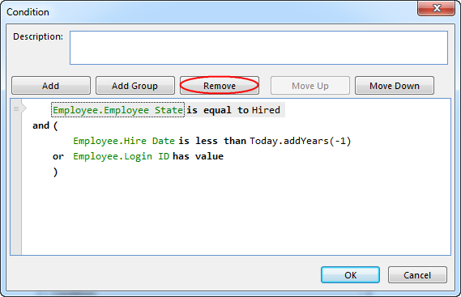

## Remove an Expression or Group

To remove an expression or a group, select the element you want to remove, and then click **Remove**. A keyboard shortcut is also available for this operations; press CTRL+DELETE to remove the selected expression or group.

When a group is removed, all expressions and groups inside the group are also removed. To keep the contained expressions and groups when removing a group, move all the elements outside the group before removing it.

Select a group, and remove it.

