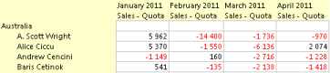
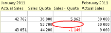

# Improving report performance

A report is capable of handling huge amounts of data and displaying these in a compact or aggregated way to your end user. As your data grows in size, it is increasingly important to focus on the performance of your report.

This article discusses how to improve report performance by providing some hints and tips regarding report design. The article is intended for report designers, i.e. users with permissions to create or modify reports.

## Hide empty rows

If your data is sparse, empty rows may be hidden by pressing the **Hide Empty Rows** button. Most often this will give you the desired effect without hurting performance.

However, if you have more than one data source in the vertical axis, you must pay attention.

Behind the scenes, a cube of all possible combinations of your vertical and horizontal axis data is created, before presenting the data on screen. To avoid unnecessary large cubes, you must make sure that your vertical axis data sources are connected, by right-clicking the data sources, and in the menu point to **Connections** and click a connection to any data source higher up in the vertical axis hierarchy.

The example below shows **Actual Sales** versus **Sales Quota**, where the data source **Employee** is grouped by **Sales Territory** in the **Vertical Axis**.

Pressing **Hide Empty Rows** will give you the desired effect.

Given 5 sales territories, 100 employees and 4 months, Genus would have created a cube containing 5 x 100 x 4 = 2 000 combinations or cells, but only display rows containing values.

By connecting the data sources along the vertical axis, as shown below, Genus does not longer need to consider the **Sales Territory** data source as being part of the cube, resulting in a cube size of 100 employees x 4 months = 400 combinations or cells, thus reducing the calculation effort by 80%.

Reports with an unfortunate use of **Hide Empty Rows** and lack of connected axis data sources, will typically use a relatively small amount of database read time (reading axis data sources) followed by a relatively long client processing period (creating the cube), before anything appears on screen.

## Hide empty columns

For the **Hide Empty Columns** button, the same guidelines apply as for the **Hide Empty Rows** button (see above), except that the data sources along the **Horizontal Axis** need to be connected.

## Formula evaluation

The entire expression inside formulas is evaluated by default, since any missing value is replaced with zeros.

To make Genus stop evaluation earlier, and thereby improve performance, in the **Formula** editor, right-click your value properties, and in the menu select **Set cell value blank if missing value**.

The options are shown below.

Only apply such a change if it makes sense in the context of your report. Changing to **Set cell value blank if missing value** in the example, will result in a blank **Sales - Quota** cell as shown below.

## Fixed local filter

Using a fixed local filter for one or more of your axis data sources will hurt performance, since values will be evaluated per axis object. If possible, change to another type of local filter.

For instance, consider creating a code domain to reflect the fixed filter, and adding a reference to this code domain from your data source. You may then change to a criteria based local filter, using a code domain value as the criteria.

To change local filter, right-click your data source, and in the menu point to **Local Filter.** The local filter alternatives will appear in the sub-menu.

## Auto fit value width

Automatic calculation of the column width may hurt performance. If it makes sense in the context of your report, consider changing to a fixed and custom column width.

To change to a custom column width, in the **Format** menu, point to **Columns**. In the sub-menu, point to **Value Width** and click **Custom**... In the dialog box, enter a custom value width and press OK.

## Formulas in formulas

The use of formulas inside formulas affects performance. For most reports this would not be noticeable, but if your report is pressed on performance, consider reducing the use of formulas inside formulas.
