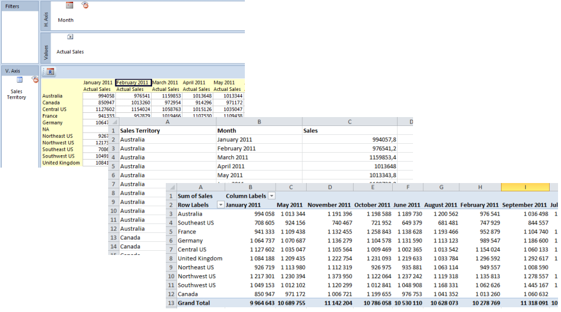
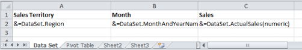
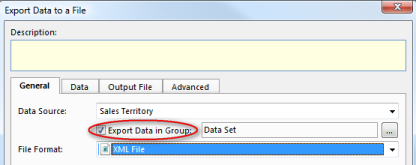
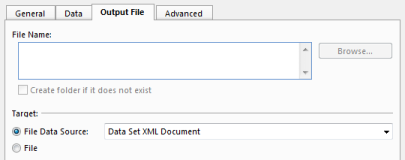
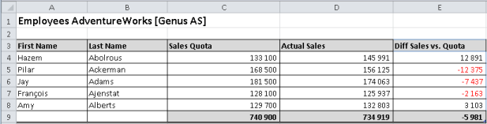
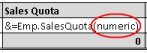

# Merge Report Data to a Microsoft Excel Document

Access to the source data in an report is a powerful feature which opens new ways to utilize a report in effects, both for reporting and calculation purposes. Combined with the lookup functions in Excel, you can define customer tailored reports, such as financial statements which require a more complex layout. Data can be queried using a [condition](../../../defining-an-app-model/common-concepts/conditions.md) or an [Advanced Expression](../../../defining-an-app-model/common-concepts/advanced-expressions.md).

The report illustrated below is merged to a Microsoft Excel spreadsheet represented as a list and as a pivot table.

When merging report data to a Microsoft Excel spreadsheet, you can access aggregated data in a report through a data source. The data can be accessed from the group named **Data Set**. The data set contains one field for each axis dimension, and one field for each value. Hidden values are excluded in the data set.

## Basic Steps

Follow these steps to perform an Excel merge.

**Step 1.** Create a report which contains field and values you want to merge. Access to the data set, the option **Include in Version Deployment** must be set. This option is only available when you create a new report in Genus Studio. A report with this option set, is included in the deployed version of your directory.

Note: Include in Version Deployment is only available for trusted users or users with app model admin rights.

**Step 2\.** Use Microsoft Excel to create and design an Excel document called a template. Note that the document does not have to be a Microsoft Excel Template (.xlt/.xltx), it can be a normal document (.xls/.xlsx). Then you insert some special fields called [smart markers](merge-table-data-to-a-microsoft-excel-document.md) into the template in places where you want to insert data from your data source.

In this example, the template used for merging data contains two worksheets. The report data set are merged into the worksheet named Data Set. In the other worksheet, data are presented in a Pivot Table.

**Step 3.** To merge data, use a task containing the report as a data source. The task contains three data sources:

*   Sales Territory (report)
*   Data Set XML Document (source data for the merge operation)
*   Sales Territory Spreadsheet (the output document of the merge operation)  

**Step 4\.** To export the data set for the report, use an **Export to a File** effect. Note that the option **Export Data in Group** allows you to export data contained within a group located in a data source.

The Data Set group for the report contains three fields. One for each axis dimension Sales Territory and Month, and one field for Actual Sales.

In **Data** tab, select fields you want to export to use in your template.

In **Output File** tab, click **File Data Source** and select source data for the merge operation.

**Step 5\.** Data are merged by using a **Merge Data to a Document** effect. To simplify the example, the template is defined as an embedded file.

It is generally not recommended to use Embedded File, since this will increase the size of your application model cache file, which may lead to increased startup time for Genus Desktop and Genus Services.

Instead of Embedded File, you can use File Data Source or File Data Field.  

## Smart Markers

Smart markers are used as placeholders for data and formulas that are inserted during a merge operation to Excel.

A smart marker starts with &=.

An example of a smart marker is **&=Emp.ActualSales**, where **Emp** represents a complex element in your XML document, and **ActualSales** represents a simple element.

A smart marker which reference an element in your XML document, is called a **Data Marker**.

In order to make calculations on the rows that are inserted, you can use a **Formula Marker**.

<table style="WIDTH: 63.69%; HEIGHT: 65px">

<tbody>

<tr>

<th>Type</th>

<th>Format</th>

<th>Example</th>

</tr>

<tr>

<td>Data Marker</td>

<td>&=xml-element-name</td>

<td>&=Emp.ActualSales</td>

</tr>

<tr>

<td>Formula Marker</td>

<td>&=&=formula</td>

<td>&=&=D{r}*C{r}</td>

</tr>

</tbody>

</table>

If a Data Marker results in more than one item, then following rows will be moved down automatically to make room for all of your data. This is also true for Formula Markers, making it possible to repeat formulas per inserted data row.

Formula Markers may reference rows that are inserted during the merge operation. The option **{r}** references the current row number. Using a number will reference a row with that number of rows offset to the current row number, e.g. **{-1}** will reference the previous row, while **{2}** will reference the row 2 rows below.

Totals can be placed on the following row after the Smart Markers to make calculations based on inserted data.

Below is a simple example of a template containing Smart Markers, and the result of merging data using the template. Note that the formula in cell C5 in the template, is a standard Excel formula **=SUM(C4:C4)**, and similar for cells D5 and E5.

The formula markers are replaced by Excel formulas during the merge, so cell E4 in the merged result, will contain the formula **=D4-C4**, E5 the formula **=D5-C5** and so on.

Note that Formula Markers may contain any valid Excel formula like:

*   &=&=SUM(B{-2}:B{-1})
*   &=&=VALUE(A{r})
*   &=&=CONCATENATE(A{r}," ",B{r})

**Hints and tips**

Using Formula Markers may result that inserted data in Excel cells is not valid. To avoid this, you can disable background error checking in your Excel sheet.

1\. In the On the **File** menu in Excel, click **Options** ****2\. In the **Excel Options** box click **Formulas**, and clear the **Enable background error checking** check box. 

## Smart Marker Parameters

A Smart Marker may contain parameters, which allow you to control the layout.

Parameters are appended to the end of the smart marker in parenthesis as a comma separated list.

<table style="WIDTH: 66.28%; HEIGHT: 161px">

<tbody>

<tr>

<th>Smart Marker Parameter</th>

<th>Description</th>

</tr>

<tr>

<td>ascending:n / descending:n</td>

<td>Sort data in Smart Markers. If n is 1, then the column is the first key of the sorter.</td>

</tr>

<tr>

<td>group:normal|repeat</td>

<td>Group data in smart markers. See [Grouping of Data](merge-table-data-to-a-microsoft-excel-document.md "Grouping of Data") for more information.</td>

</tr>

<tr>

<td>horizontal</td>

<td>Write data left-to-right, instead of top-to-bottom.</td>

</tr>

<tr>

<td>noadd</td>

<td>Do not add extra rows to fit data.</td>

</tr>

<tr>

<td>numeric</td>

<td>Convert text to number if possible.</td>

</tr>

<tr>

<td>shift</td>

<td>Shift down or right extra rows/columns to fit data.</td>

</tr>

<tr>

<td>skip:n</td>

<td>Skip n number of rows for each row of data.</td>

</tr>

</tbody>

<colgroup><col width="300" style="WIDTH: 300px"><col width="300" style="WIDTH: 300px"></colgroup></table>

If you have multiple parameters, separate them with a comma, *but no space*.

**noadd and skip**

The parameters **noadd** and **skip** may be combined to insert alternating data on every other row. Since the template is processed from the bottom to the top, you should add the **noadd** on the first row to avoid extra rows from being inserted before the alternate row.

The example below illustrates inserting data on every other row using **noadd** and **skip**.

**numeric**

Use **numeric** to tell Excel that the merged cells have a numeric content, and are to be formatted as numbers, as opposed to text.

Note: This also applies for date formats, since dates are stored as numeric values in Excel.

**Hints and tips**

If you want to format every other row in a different color or similar, you may use Excel Conditional Formatting with the formula **=ISEVEN(ROW())** or **=ISODD(ROW())**.

