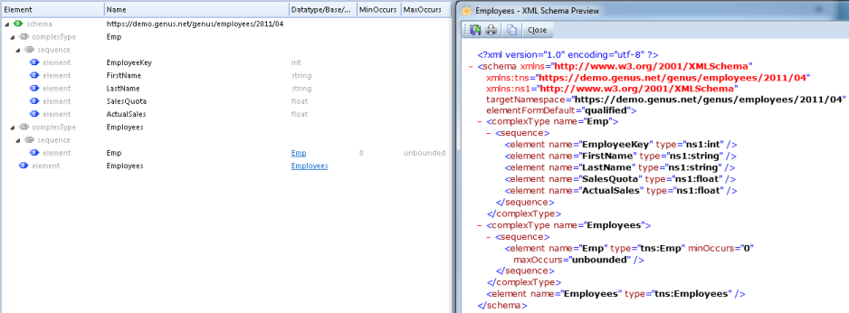
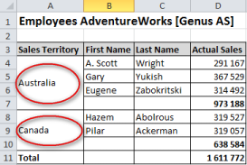

## Merge Table Data to a Microsoft Excel Document

The example below shows a possible result after merging a selection of Employees.

Note that the Excel merge feature is made possible by using special tags called [Smart Markers](merge-table-data-to-a-microsoft-excel-document.md), since Microsoft Excel natively do *not* support the same flexibility as Microsoft Word. The native Excel mechanisms - which are *not* used - is to connect to external data sources through a data connection, which is a set of information that describes how to locate, sign in, query, and access the external data source.

## Basic Steps

Follow these steps to perform an Excel merge.

**Step 1\.** Create an XML Schema defining the structure, content and semantics of the XML document used to provide data during the merge operation. If data are imported from an external source, you do not need to create an XML Schema. That is, the XML data can be imported directly into a General File data source.

**Step 2\.** Use Microsoft Excel to create and design an Excel document called a template. Note that the document does not have to be a Microsoft Excel Template (.xlt/.xltx), it can be a normal document (.xls/.xlsx). Then you insert some special fields called [smart markers](merge-table-data-to-a-microsoft-excel-document.md "Smart Markers") into the template in places where you want to insert data from your data source.

**Step 3.** In your Task, Web Service or Agent, add data sources which can hold the XML document, the template and the output document. The XML document can be imported from file, or you can create an XML document by assigning values from other data sources.

**Step 4\.** In your Task, Web Service or Agent, include a merge effect describing which template to use, the data source containing the XML data, the data source where the merged document should be written to, and the file format for the merged document. See [here](../../../defining-the-app-model/logic/action-orchestration/actions/effects/merge-data-to-a-document.md "The Merge Data to a Document Effect") for more information.

## Grouping of Data

Using Smart Markers you may break data into groups and insert calculations for each group, typically a summary per group.

The data are broken into groups using the [Smart Marker Parameter](merge-table-data-to-a-microsoft-excel-document.md) **group** with the options **normal**, **repeat** or **merge**. Note that the data which you want break into groups, have to be sorted in advance. It is not possible to combine smart markers for grouping and sorting.

Calculations per group is set up using the special Smart Marker **&=****subtotalN:Data Marker**. **N** is a number between 1 and 11, and specifies which summary function to apply, i.e. 1=AVERAGE, 2 =COUNT, 3=COUNTA, 4=MAX, 5=MIN, 6=PRODUCT, 7=STDEV, 8=STDEVP, 9=SUM, 10=VAR, 11=VARP. The number is equivalent to the **function_num** argument in the **SUBTOTAL** function in Excel. **:Data Marker** refers back to the data marker with the group option. The formula in cell D6 in the template, is a standard Excel formula =**SUBTOTAL(D4:D4)**.

The example below shows the grouping of **Actual Sales** per **Sales Territory**.

The result:

Replacing **normal** with **repeat** in **&=Emp.SalesTerritory(group:normal)** gives the following result:

Replacing **normal** with **merge** in **&=Emp.SalesTerritory(group:normal)** gives the following result:

## Smart Markers

Smart markers are used as placeholders for data and formulas that are inserted during a merge operation to Excel.

A smart marker starts with &=.

An example of a smart marker is **&=Emp.ActualSales**, where **Emp** represents a complex element in your XML document, and **ActualSales** represents a simple element.

A smart marker which reference an element in your XML document, is called a **Data Marker**.

In order to make calculations on the rows that are inserted, you can use a **Formula Marker**.

<table style="WIDTH: 63.69%; HEIGHT: 65px">

<tbody>

<tr>

<th>Type</th>

<th>Format</th>

<th>Example</th>

</tr>

<tr>

<td>Data Marker</td>

<td>&=xml-element-name</td>

<td>&=Emp.ActualSales</td>

</tr>

<tr>

<td>Formula Marker</td>

<td>&=&=formula</td>

<td>&=&=D{r}*C{r}</td>

</tr>

</tbody>

</table>

If a Data Marker results in more than one item, then following rows will be moved down automatically to make room for all of your data. This is also true for Formula Markers, making it possible to repeat formulas per inserted data row.

Formula Markers may reference rows that are inserted during the merge operation. The option **{r}** references the current row number. Using a number will reference a row with that number of rows offset to the current row number, e.g. **{-1}** will reference the previous row, while **{2}** will reference the row 2 rows below.

Totals can be placed on the following row after the Smart Markers to make calculations based on inserted data.

Below is a simple example of a template containing Smart Markers, and the result of merging data using the template. Note that the formula in cell C5 in the template, is a standard Excel formula **=SUM(C4:C4)**, and similar for cells D5 and E5.

The formula markers are replaced by Excel formulas during the merge, so cell E4 in the merged result, will contain the formula **=D4-C4**, E5 the formula **=D5-C5** and so on.

Note that Formula Markers may contain any valid Excel formula like:

*   &=&=SUM(B{-2}:B{-1})
*   &=&=VALUE(A{r})
*   &=&=CONCATENATE(A{r}," ",B{r})

**Hints and tips**

Using Formula Markers may result that inserted data in Excel cells is not valid. To avoid this, you can disable background error checking in your Excel sheet.

1\. In the On the **File** menu in Excel, click **Options** ****2\. In the **Excel Options** box click **Formulas**, and clear the **Enable background error checking** check box. 

## Smart Marker Parameters

A Smart Marker may contain parameters, which allow you to control the layout.

Parameters are appended to the end of the smart marker in parenthesis as a comma separated list.

<table style="WIDTH: 66.28%; HEIGHT: 161px">

<tbody>

<tr>

<th>Smart Marker Parameter</th>

<th>Description</th>

</tr>

<tr>

<td>ascending:n / descending:n</td>

<td>Sort data in Smart Markers. If n is 1, then the column is the first key of the sorter.</td>

</tr>

<tr>

<td>group:normal|repeat</td>

<td>Group data in smart markers. See [Grouping of Data](merge-table-data-to-a-microsoft-excel-document.md "Grouping of Data") for more information.</td>

</tr>

<tr>

<td>horizontal</td>

<td>Write data left-to-right, instead of top-to-bottom.</td>

</tr>

<tr>

<td>noadd</td>

<td>Do not add extra rows to fit data.</td>

</tr>

<tr>

<td>numeric</td>

<td>Convert text to number if possible.</td>

</tr>

<tr>

<td>shift</td>

<td>Shift down or right extra rows/columns to fit data.</td>

</tr>

<tr>

<td>skip:n</td>

<td>Skip n number of rows for each row of data.</td>

</tr>

</tbody>

<colgroup><col width="300" style="WIDTH: 300px"><col width="300" style="WIDTH: 300px"></colgroup></table>

If you have multiple parameters, separate them with a comma, *but no space*.

**noadd and skip**

The parameters **noadd** and **skip** may be combined to insert alternating data on every other row. Since the template is processed from the bottom to the top, you should add the **noadd** on the first row to avoid extra rows from being inserted before the alternate row.

The example below illustrates inserting data on every other row using **noadd** and **skip**.

**numeric**

Use **numeric** to tell Excel that the merged cells have a numeric content, and are to be formatted as numbers, as opposed to text.

Note: This also applies for date formats, since dates are stored as numeric values in Excel.

**Hints and tips**

If you want to format every other row in a different color or similar, you may use Excel Conditional Formatting with the formula **=ISEVEN(ROW())** or **=ISODD(ROW())**.

