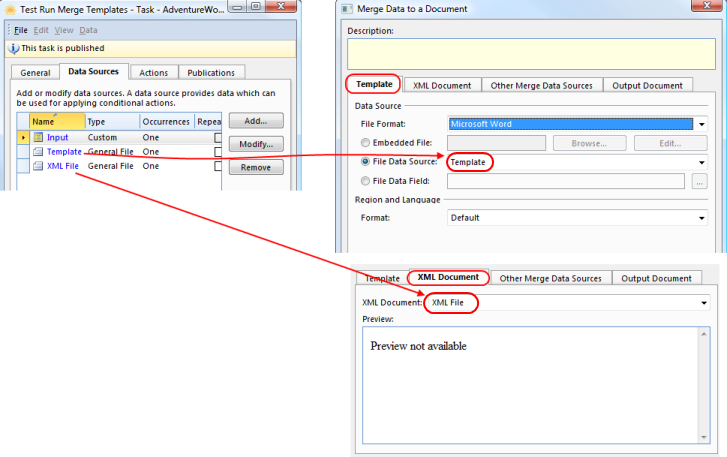

## Test Run Merging Template

To create a template there are often many adjustments involved. The possibility to test run merging template, to see the output result, is often useful, and may make it easier to design the template.

When merging you need a template document and an XML Document. The effect [Merge Data to a Document](../../defining-an-app-model/action-orchestration/actions/effects/merge-data-to-a-document.md) does not require the templates and XML document to be defined in [Genus Studio](../../defining-an-app-model/getting-started/getting-started.md). The effect accepts also data sources of type General File as XML Document and template.

This makes it possible to define a generic task, to draft and test template for merging. The task needs input file which are the XML file that contains test data and the template, for example from your local disk. Then the effect [Import Data](../../defining-an-app-model/action-orchestration/actions/effects/import-data.md) imports data into a data source of the type General File. The effect Merge Data to a Document will merge data based on the contents in data source of type General File.

