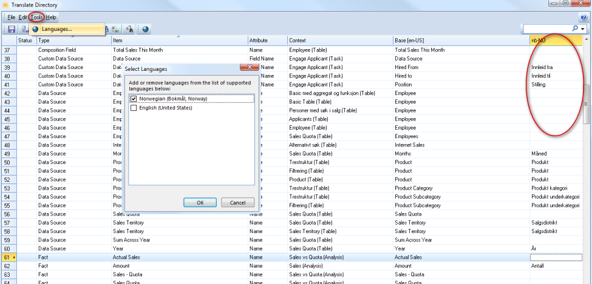

# Translate the App Model to other languages

Genus Apps supports multiple languages in an App Model. You can translate your app to several languages allowing the individual users to choose their preference, for example if you have offices in different countries.

The app is translated in the directory, and every part of the App Model can be translated to all supported languages. For example objects, object properties, tasks, tables etc.

If support for multiple languages in the app data is required, this must be defined specifically in the app model, for example by adding extra objects and fields for extra languages.

To translate directory to another language, do the following:

1.  In the **Directory**, on the **Tools** menu, click **Translate Directory**.
2.  In the **Translate Directory** window, on the **Tools** menu, click **Languages** to add language.
3.  In **Select Languages** dialog box, select language you want to add and click **OK**.
4.  Type in the translate words in the cells for the language you add.
5.  On the **Toolbar**, click **Save**.  

