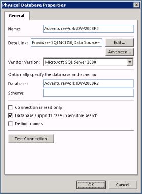

## Configure Genus Server - Step by Step

[Start](../../defining-the-application-model/object-class/modify-an-object--or-identifier-domain/how-to-start-the-genus-configuration-application.md "How to start the Genus Configuration application") the Genus Configuration Application.

**Step 1 - Assign a Web Server Certificate**

Genus App Services recommends using secure HTTP communication between any clients and the Genus App Services application server.

If you do not want to use secure HTTP communication, skip the rest of this step.

A secure HTTP communication requires a Web Server Certificate.

If you do not have a certificate, see the article [Create a Web Server Certificate](../../defining-the-application-model/action-orchestration/actions/effects/create-a-web-server-certificate.md "Create a Web Server Certificate") for more information about how to create one. This involves creating a certificate request and getting a certificate response back from your system administrator or third party. Once you have such a certificate response available, see the article [Assign a Web Server Certificate](../../defining-the-application-model/action-orchestration/step-4--assign-a-web-server-certificate.md "Step 4 - Assign a Web Server Certificate") for more information about how to assign it.

If you have a certificate available already, see the article [Assign a Web Server Certificate](../../defining-the-application-model/action-orchestration/step-4--assign-a-web-server-certificate.md "Step 4 - Assign a Web Server Certificate"). This applies for example if you have a wildcard certificate *.yourdomain.com and want to assign yourserver.yourdomain.com.

**Step 2 - Create a Directory**

To provide functionality to the end user, Genus employs declarative data about your business objects and logic. This collection of [metadata](../../defining-the-application-model/glossary.md) are maintained in **Genus Studio** and stored in a central database.

The Directory is split into two partitions: **Descriptive Partition** and **Active Partition**. The Descriptive Partition contains the definition of Object Classes, Rules, Forms and concepts like Reports, Tasks, Agents and Web Services. The Active Partition contains information related to the run-time environment for your application, for example user accounts and audit trails.

1.  Create a separate database or schema for the Descriptive Partition and the Active Partition. It is recommended that the two partitions are stored in separate databases or schemas for maintenance reasons.
2.  In the console tree of the Genus Configuration application, right-click the **Directories** folder. In the shortcut menu, point to **New** and then click **Directory**.
3.  In the **Name** box, type name for the Directory. The name will appear as part of the title bar in the Genus desktop client.
4.  In the **Internet Host Name** box, type a name which identifies your server (host) on the network. The name is typically a combination of the local name for the server and the name for its parent domain. For example, the Internet hostname yourserver.yourdomain.com consists of a local hostname (yourserver) and the domain name (yourdomain.com). See also [Naming the Virtual Directory](../../defining-the-application-model/object-class-property/naming-the-virtual-directory.md "Naming the Virtual Directory") for more information.
5.  In the **Descriptive Partition** and **Active Partition** sections, click **Edit** to define a data link to the database where the descriptive- and active partition data are stored. In the **Database** and **Schema** boxes, type a database or schema. Depending on the database system vendor, you must either provide a database or a schema. See [Specifying a Database and a Schema for a Data Link](../specifying-a-database-and-a-schema-for-a-data-link.md "Specifying a Database and a Schema for a Data Link") for more information.
6.  In the **Vendor Version** box, select a database vendor version. See [Supported Database System Vendors](../system-requirements.md) for more information.
7.  If the database supports case insensitive search, select the **Database supports case insensitive search** check box.
8.  Click **Connect** to connect to the directory partitions. In order to continue, a connection to the directory partitions is required.
9.  In the **Default Language** box, select the default language for the Directory. The selected language is used as the base language for applications providing multi-language support.

**Step 3 - Create Directory Database Objects**

1.  Click the **Database Objects** tab.
2.  Click **Manage Database**. In the **Database Management** wizard, click **Create missing database objects**.
3.  Click **Next**.
4.  A summary of all objects that will be created is displayed. Click **Finish** to create the objects.

**Step 4 - Create Logical Databases**

Logical databases are used to define the location of database tables associated with Object Classes in Genus Directory. For each Data Set defined in your Directory, logical databases are associated with physical databases (see step 5 for more information about physical databases). For example, many ERP systems contains data for several companies. If the data are stored in different schemas or databases, you would create one logical database, for example Financial Data, and for each Data Set associate the logical database with a different physical database.

It is also possible to define a logical database where data are shared between Data Sets, for example centralized code tables containing postal codes, countries, currencies etc.

1.  Click the **Logical Databases** tab.
2.  In the **Name** box, type a name for the database.
3.  If data are shared between Data Sets, select the **Data in this logical database are shared between Data Sets** check box. In the **Physical Database** box, select a database (see step 5 for more information on how to define physical databases).
4.  Click **OK**.

**Step 5 - Create Physical Databases**

A physical database is defined by a datalink and a database or schema, and is used to establish connection to your business data. As described in step 4, logical databases are associated with physical databases for each Data Set defined in your Directory.

1.  Click the **Physical Databases** tab.
2.  Click **Add**.
3.  In the **Name** box, type a name for the database.
4.  Click **Edit** to the right of the **Data Link** box to define the data link to use when connecting to the database. See [Edit Data Link](../../defining-the-application-model/forms/views/desktop-controls/file-and-folder-controls/edit-data-link.md "Edit Data Link") for more information.
5.  In the **Vendor Version** box, select a database vendor version. See [Supported Database System Vendors](../system-requirements.md) for more information.
6.  In the **Database** and **Schema** boxes, type a database or schema. Depending on the database system vendor, you must either provide a database or a schema. See [Specifying a Database and a Schema for a Data Link](../specifying-a-database-and-a-schema-for-a-data-link.md "Specifying a Database and a Schema for a Data Link") for more information.
7.  Select the **Connection is read only** check box if data never are written to this database.
8.  If the database supports case insensitive search, select the **Database supports insensitive search** check box.
9.  Select the **Delimit names** check box if your database uses RDBMS reserved words for object names, like a table name Order, which is reserved in Microsoft SQL Server. Genus uses bracets ([ ]) as delimiters in Microsoft SQL Server, and quotes (" ") as delimiters in Oracle.
10.  Click **Test Connection** to verify that the connection succeded.
11.  Click OK.

Below is an example of a Physical Database setup for a Microsoft SQL Server 2008 database.  

**Step 6 - Create Data Sets**  

A Data Set is a collection of data for a single unit of business. For example, many ERP systems contains data for several companies. If the data are stored in different schemas or databases, you need to create a Data Set for each company.

1.  In the console tree, expand the folder for your Directory. Right-click the **Data Sets** folder. In the shortcut menu, point to **New**, and then click **Data Set**.
2.  In the **Name** box, type a name for the Data Set. The name will appear as part of the title bar in the Genus desktop client.
3.  In the **Virtual Directory** box, type a name for the virtual directory associated with the Data Set. See Naming the Virtual Directory for more information.
4.  Click **OK**.

**Step 7 - Associate Logical Databases with Physical Databases**

Logical databases are used to define the location of database tables associated with Object Classes in Genus Studio. For each Data Set defined in your Directory, logical databases are associated with physical databases. That is, when a user signs in to a Data Set, data for an Object Class are read from the physical database connected to the logical database associated with the Object Class.

1.  Click on the **Data Sets** folder, and in the list of data sets double click the data set.
2.  Click the **Database Connections** tab.
3.  In the **Database** list, select a physical database for each logical database.

**Step 8 - Authentication**

The authentication service in Genus App Services provides sign in authentication and user authorization. Your users are granted access to your Genus application according to their credentials, based on Microsoft Active Directory principles. The authentication service is integrated with your Active Directory. However, it is possible to to configure Genus without Active Directory using your own user account data.

1.  In the console tree, right-click the folder for your Directory, and then in the shortcut menu, click **Properties**.
2.  Click the **Authentication** tab.
3.  If you want to use your own user account data to authenticate users, click **Genus Directory**. If you want users to be authenticated by Active Directory, click **Active Directory**. See [Genus App Services Authentication](../../defining-the-application-model/action-orchestration/actions/effects/genus-app-services-user-authentication.md "Genus App Services User Authentication") for more information.
4.  If you have selected **Active Directory**, specify LDAP Path and Account identifier information as needed. If you want to manage your security groups within Genus Studio, under the **Security Group Administration** group, click **Genus Directory**. If you want to manage your security groups within Active Directory, click **Active Directory**. See [Active Directory Security Group Administration](active-directory-security-group-administration.md "Active Directory Security Group Administration") for more information.

Genus App Services now offers authentication against multiple Active Directory domains simultaneously. Please make sure that your application server(s) is granted the necessary privileges to access the required domain controllers. You need to use a unique account identifier across your domains, so unless you can guarantee that sAMAccountName is unique across your domains, you should opt for objectGUID or objectSID as your account identifier.

**Step 9 - Create an Administrator Account**

To be able to sign in to Genus Studio for the first time, you need to create an administrator account.

1.  In the console tree of the Genus Configuration application, right-click the directory, which was created in step 1, and select **Properties**.
2.  Click the **Database Objects** tab.
3.  Click **Manage Database**. In the **Database Management** wizard, click **Create an administrator account**.
4.  Click **Next**.

If you are using Genus Directory authentication, follow these steps:

1.  In the **Name** box, type a name for the administrator account.
2.  In the **Sign in Name** box, type a sign in name for the administrator account.
3.  In the **Password** box, type a password. and then type the password again in the **Confirm Password** box. The password must contain at least 6 characters.
4.  Click **Finish**.

If you are using Active Directory authentication, make sure you are signed in using a domain account on your application server, and then follow these steps:

1.  Click **Select User**.
2.  In the **User** box, type the name of an Active Directory user account.
3.  Click **Find Now**.
4.  In the **Users** list, click the user you want to create an account for.
5.  Click **OK**.
6.  Click **Finish**.

**Step 10 - Create Trusted Users**

Metadata stored in the descriptive partition of the Directory can only be modified by trusted users. At least one user has to be trusted.

1.  Click the **Trusted Users** tab.
2.  Click **Add**.
3.  In the **Select Trusted Users** dialog, enter the sign in name for the administrator account created in the step above. Click **Check Names**, and then click **OK**.

**Step 11 - Redirect to secure connection**

If you do not want to use secure HTTP communication and a Web Server Certificate (see one of the previous steps), you must turn redirection to a secure connection off. To turn redirection to a secure connection off, in the **File** menu, point to Tools, and then click **Options**. Uncheck **Redirect to Secure Connection** and click OK.

 **Step 12 - Restart Genus Services** 

[A restart of Genus Services](../../defining-the-application-model/general-settings/restart-genus-app-services.md "Restart Genus App Services") is required to make your changes take effect.

**Step 13 - Install License** **A license file is required in order to start the Genus App Platform. See** [Install License on Genus App Services applicaion server](../install-license-on-genus-server.md) for more information. 

**Step 14 - Install the Genus Desktop Client Application**

The client is normally installed on your personal computer, but may also be installed on your Genus App Services application server.

See [Install Genus on Your Computer](../install-genus-desktop-client-on-your-computer.md) for more information. The preferred client installation method at this point is by using an Internet Address.

 **Step 15 - Define Nodes and Node Groups

 **Genus services are run on servers, or Nodes, per data set or independently of data sets. For a Genus App Services server to provide any services it must be added to the directory as a Node, and added to a Node Group.**

If you are using Active Directory authentication, you must sign in to the computer using the administrator account previously created.**

1.  [Open Genus Studio](../../defining-the-application-model/genus-studio-basics/how-to-open-genus-studio.md)
2.  To add a Node, in the Directory tree, locate Resources and then click on Nodes.
3.  In the File menu, click New.
4.  Specify the node settings, and click OK.
5.  To add a Node Group, in the Directory tree, locate Resources and then click on Nodes Groups.
6.  In the File menu, click New.
7.  Specify the node group settings, and click OK.

For more information on specific settings, see [Nodes and Node Groups](../../defining-the-application-model/nodes-and-node-groups.md). Step 16 - Deploy the Directory 

The initial set of metadata needs to be deployed to Genus desktop clients. This can be done from the computer where you installed the Genus desktop client in step 15\.

If you are using Active Directory authentication, you must sign in to the computer using the administrator account previously created.

If you did not close Genus Studio in the previous step, skip step 1 below.

1.  [Open Genus Studio](../../defining-the-application-model/genus-studio-basics/how-to-open-genus-studio.md)
2.  In the **File** menu, click **Deploy Directory to All Computers**.
3.  Click **OK**.

**Next step**

You should also consider creating [security groups](../../security-and-privacy/security-groups-and-user-accounts.md) for the users, and assigning [privileges](../../security-and-privacy/security-privileges.md), [permissions](../../security-and-privacy/security-permissions.md), and [access to data sets](../../security-and-privacy/security-data-sets.md).

You may also want to create a Windows Scheduled Task to [automatically delete old log files](automatically-delete-old-log-files.md) created by Genus App Services.

To enable the use of Agents and Web Services, the logical services must be enables. See [Genus App Services - Logical Services](genus-server--logical-services.md).

For best performance and stability, the Genus App Services must be configured using the Management Console described in the topics below.