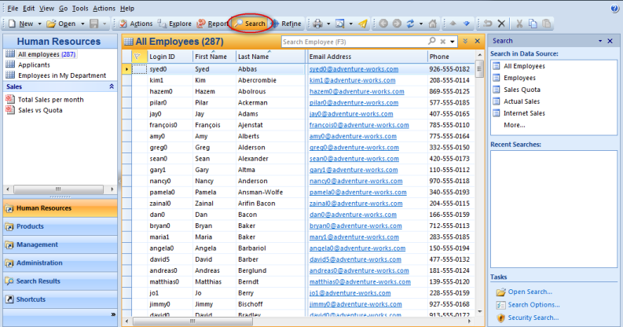

## Searching for Data

Genus App Platform offers number of ways to search in your business data. Anyone at any business or technical skill level across your corporation can search a large number of objects by simply opening an existing search. You can find objects by providing criteria with a simple search, or you can use a multi-step advanced search to execute more sophisticated search operations. Furthermore, you can search for objects with a given property or a given event, and consolidate the results into a uniform format and listing.

The **Search Task Pane** can be opened by clicking Search in the toolbar. 

To learn more about search, explore the topics below. 

See Also

*   [Security on Search](guidelines and best practices/security on search.md)

<table cellpadding="0" cellspacing="0" width="100%" class="cdclvSuggestTable">

<tbody>

<tr>

<td width="100%" class="cdclvSuggestTitle">Topics in "Searching for Data"</td>

<td class="cdclvSuggestTitle"><nobr>10 items</nobr></td>

</tr>

<tr>

<td class="cdclvCategoryCont" colspan="2">

<table cellpadding="0" cellspacing="0" width="100%">

<tbody>

<tr>

<td valign="top" class="cdclvCategoryCol1">[Search for Objects](../users/searching for data/search for objects.md)</td>

<td valign="top" class="cdclvCategoryCol2">[Search For Other Data Sources](../users/searching for data/search for other data sources.md)</td>

</tr>

<tr class="cdclvCategoryRowAlt">

<td valign="top" class="cdclvCategoryCol1">[Search Based on Other Data Sources](../users/searching for data/search based on other data sources.md)</td>

<td valign="top" class="cdclvCategoryCol2">[Using Advanced Search](../users/searching for data/using advanced search.md)</td>

</tr>

<tr>

<td valign="top" class="cdclvCategoryCol1">[Search with Accelerators](../users/searching for data/search with accelerators.md)</td>

<td valign="top" class="cdclvCategoryCol2">[Search in History](../users/searching for data/search in history.md)</td>

</tr>

<tr class="cdclvCategoryRowAlt">

<td valign="top" class="cdclvCategoryCol1">[Save Searches and Selections](../users/searching for data/save searches and selections.md)</td>

<td valign="top" class="cdclvCategoryCol2">[Open a Search](../users/searching for data/open a search.md)</td>

</tr>

<tr>

<td valign="top" class="cdclvCategoryCol1">[Viewing Search Results](../users/searching for data/viewing search results.md)</td>

<td valign="top" class="cdclvCategoryCol2">[Search Options](../users/searching for data/search options.md)</td>

</tr>

</tbody>

</table>

</td>

</tr>

</tbody>

</table>