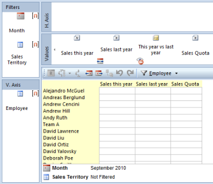

# Grouping and Filtering

Use Data Sources to group and filter data in a report. There are three types of data sources; time, objects and codes. The data sources are used to group the data along either the vertical axis or horizontal axis, and filtering the data in the report. A data source can for example be employee, sales territory, marital status, month, week, or year.

**Topics in "Grouping and Filtering"**
* [Data Sources](data-sources.md)
* [Time Data Sources](time-data-sources.md)