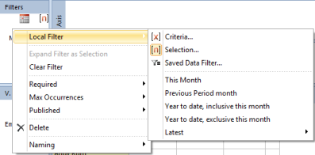

## Time Data Sources

Time data sources are used to filter on time, or to group data on a time period.

You can place a time data source in Filters field or in one of the axis. If the time data source is placed in the Filters field, the default filter is set to the current period. For example the time data source month, will be set to current month. If the time data source is placed in one of the axis, the default filter is year-to-date.

The following time data sources are available:

After adding a time data source to the report, the settings can be changed. To edit time data source, right-click the data source and select from the menu.  

<table style="WIDTH: 100%">

<tbody>

<tr>

<th>Time Data Source Options</th>

<th>Description</th>

</tr>

<tr>

<td>**Local Filter**</td>

<td>

Set which type of filter search or select the time.

To set default filters, right-click the data sources in filter or in the axis and point to Local Filters and clicks None, Criteria, Selection or Fixed. To select members or set criteria for the data source, double-click the data source to open.

*   **Criteria** set criteria to search for the time period. You can use the preset criteria in the menu or you can create a time function for the time data source. Use of criteria creates a dynamic reports.

*   **Selection** manual selected time period.

*   **[Saved Data Filter](../data-filters.md)** (inserts predefined data filter as filter)

</td>

</tr>

<tr>

<td>**Required**</td>

<td>Set whether the time data source is required or not. If required, the user has to set filter to run the report.</td>

</tr>

<tr>

<td>**Max Occurences**</td>

<td>

Set whether the user can select one or many members in filter.

</td>

</tr>

<tr>

<td>**Published**</td>

<td>Publish the time data source, so users have rights to change the filter in report in run mode.</td>

</tr>

<tr>

<td>**Delete**</td>

<td>Remove the time data source from Filters field or the axis.</td>

</tr>

<tr>

<td>**Naming**</td>

<td>Customize the name of members by choosing naming properties from data source.</td>

</tr>

</tbody>

</table>

## Absolute and Relative Time Filter

When aggregating large amounts of data it is often neccessary to restrict the amount of data as much as possible. Often it is useful to add a time based filter, both from a functional user perspective and from a performance perspective.

The time filter can be set up as an absolute time filter or a relative time filter. An absolute time filter is based on specific periods or specific dates, either in a selection or in a criteria. A relative time filter can be defined as a criteria based on a time function or a predefined time function. A time function is based on a date, either the current date or a date from the directory, and then time steps are added to modify the result date, for example Beginning of Year and Back 3 Months.

In this way, the report is dynamic and can always default to the relevant period, for example the last three months.

