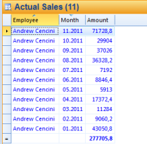

# Navigate Filters and Explore Data

The navigation and explore functions make it easy to move back and forward. It let you also drill down filters of type hierarchy and explore more detailed data.

Note that the navigation and explore functions must be published, to allow use of these functions in run mode.

For more information about publishing functions, see [Publishing Functions and Options](publishing-functions-and-options.md).  

<table style="WIDTH: 100%">

<tbody>

<tr>

<th>Navigation Options</th>

<th>Description</th>

</tr>

<tr>

<td>** Drill down** and **Drill Up**</td>

<td>Navigate down and up to display detail data in different levels.

Note that to drill, the axis has to contain a hierarchic data source and the data source has to be published. To get back on the preceding level, use the back function.

</td>

</tr>

<tr>

<td>** Shift time reference back** and **Shift time reference forward**</td>

<td>Shift back and forward in the available time periods in the report. To shift time reference, click  button to the right to the icon and select time period.</td>

</tr>

<tr>

<td>** Explore**</td>

<td>

Explore to display the details for the aggregated value.

 

</td>

</tr>

<tr>

<td>** Back** and **Forward**</td>

<td>Navigate back to forward to previous step. For example after a drill down you can get back to previous view by clicking Back button.</td>

</tr>

</tbody>

</table>