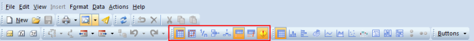

# View Options

View Options let you customize your view of the report. It is possible to hide different elements, such as empty row, empty column, filter pane, description pane and warnings.

The view options must be published, to allow use of these functions in run mode. For more information about publishing functions, see [Publishing Functions and Options](publishing-functions-and-options.md).  

<table style="WIDTH: 100%">

<tbody>

<tr>

<th>View Options</th>

<th>Description</th>

</tr>

<tr>

<td>** Show Value Names**</td>

<td>Show or hide the row or column in a grid that displays the name of the values. This is useful when there is only one value in a report. Note that this function has only effect for grid-reports.</td>

</tr>

<tr>

<td>** Value Orientation**</td>

<td>

Place values along the vertical or horizontal axis of a grid.

</td>

</tr>

<tr>

<td>** Scale Values**</td>

<td>Scale all the values by a given factor.</td>

</tr>

<tr>

<td>** Show Warnings**</td>

<td>Hide or show warnings in the warning pane below the report.</td>

</tr>

<tr>

<td>** Hide Empty Rows**</td>

<td>Control whether rows without values are visible. This function is only effective in a grid with value along the horizontal axis.</td>

</tr>

<tr>

<td>** Hide Empty Columns**</td>

<td>Control whether columns without values are visible. This function is only effective in a grid.</td>

</tr>

<tr>

<td>** Filter Pane**</td>

<td>Show or hide the selection pane.</td>

</tr>

<tr>

<td>** Description Pane**</td>

<td>Show or hide the description pane.</td>

</tr>

</tbody>

</table>