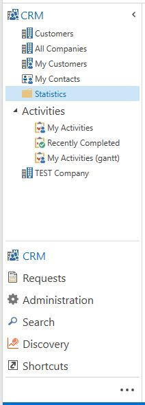

# Navigation pane 
The navigation pane in Genus Desktop provides your main entry points to your data and the different parts of the App Model.

In the navigation pane you may find:
- Large view buttons which contain related shortcuts
- A search area
- A [discovery](../analyze-report-and-discover/index.md) area
- Your personal shortcuts

The navigation pane is customizable with regards to compactness and the amount of large view buttons shown. It is possible to hide the navigation pane to get a larger working area, and view buttons that are not of interest can be hidden.

Depending on the App Model there might be one or more large view buttons. When clicking on one of the large view buttons, its associated shortcuts are shown. Related shortcuts may be grouped together or placed in folders. The user cannot rearrange or change the grouping of non-personal shortcuts.

The figure below illustrates an example of the content in a navigation pane:

## Personal shortcuts
You can add your personal shortcuts under the dedicated shortcuts View Button. To do this you must first add a group under the shortcut area. 

When a group is added you may right-click in the group and add a shortcut in this way or copy your favorite shortcuts and buttons from another view. The latter is done by right clicking on the shortcut or object and choosing “Copy shortcut”. The shortcut can then be pasted onto your group of choice under the large shortcut view button.

The personal shortcuts are rearrangeable from the right click menu.

## Change the start page in the navigation pane
The start page is displayed when you first start the Genus Desktop client. To change the start page, right-click a shortcut in the Navigation Pane, and then on the shortcut menu, click Set as Start Page.
