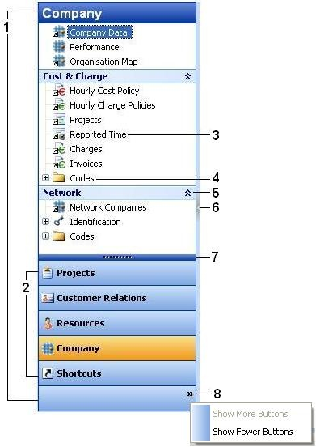

# Navigation Pane

The Navigation Pane appears in the main window in the Genus desktop client. You can resize or hide the Navigation Pane. The contents of the Navigation Pane change depending on what view you are working in. Each view offers access to information and tasks pertaining to that view.

The view buttons at the bottom of the Navigation Pane correspond to different views. Depending on the view that you choose, you see a different set of groups, folders and shortcuts. You can change the number and size of the view buttons, but you cannot rearrange the individual panes within the Navigation Pane.

The figure below illustrates an example of the content in a Navigation Pane:

1 Navigation Pane

2 Large buttons used to switch views

3 Shortcuts

4 Folders

5 Groups

6 Vertical splitter bar used to resize or hide the Navigation Pane

7 Horizontal splitter bar used to show or hide buttons

8 Commands for changing the Navigation Pane apperance

## Add or remove buttons in the Navigation Pane

To increase space in the Navigation Pane quickly, you can change from large buttons that are displayed vertically at the bottom of the pane to small buttons that are displayed horizontally across the bottom of the pane. Point to the horizontal splitter bar (7). When the pointer turns into a double-headed arrow, drag the splitter bar up or down. If you drag the horizontal splitter bar to the bottom of the Navigation Pane, all the large buttons are converted to small buttons and appear in a single row at the bottom of the pane.

To add or remove one button at a time, at the bottom of the Navigation Pane, click **Configure buttons** (8), and then click **Show More Buttons** or **Show Fewer Buttons**.

## Resize the Navigation Pane

Point to the right border of the Navigation Pane, and when the pointer becomes a double-headed arrow, drag the border to the left or right.

## Hide the Navigation Pane

Click the left-arrow (6) on the right border of the Navigation Pane, or press the key combination ALT+F1. To show the Navigation Pane, click the right-arrow(6) in the minimized Navigation Pane, or press the key combination ALT+F1.

## Change the Start Page in the Navigation Pane

The Start Page is displayed when you first start the Genus Desktop client. To change the start page, right-click a shortcut in the Navigation Pane, and then on the shortcut menu, click **Set as Start Page**.

## Working with Shortcuts and Shortcut Groups

Genus provides personal shortcuts in the Navigation Pane for quick access to your most frequently used items. The shortcuts are organized into groups, and the groups can be arranged in the **Shortcuts** view of the Navigation Pane.

**Add a Group**

1. In the Navigation Pane, click the **Shortcuts** view button.
2. Right-click in the **Shortcuts** pane, and then in the shortcut menu, click **Add Group**.
3. Type a name for the group in the box.

**Add a Shortcut to a Group**

1. In the Navigation Pane, click the **Shortcuts** view button.
2. Right-click the group which you want to add a shortcut to, and then in the shortcut menu, click **Add Shortcut**.
3. Follow the instructions in the **Create Shortcut** wizard. You can create shortcuts to objects such as a Report, a Search or a business object. In addition you can create shortcuts to web documents.

Tip! You can also copy a shortcut from another view to the **Shortcuts** view. This is a convenient way to organize your most frequently used shortcuts.

Tip! To create a shortcut to a specific object, for example a person, right-click the object, and then in the shortcut menu, click **Copy Shortcut**. Right-click the group you want to add the shortcut to, and then in the shortcut menu, click **Paste**.

**Rename a Shortcut or a Group**

1. In the Navigation Pane, click the **Shortcuts** view button.
2. Right-click the shortcut or group that you want to rename, and then in the shortcut menu, click **Rename**.
3. Type a name for the shortcut or group in the box.

**Move a Shortcut to another Group**

1. In the Navigation Pane, click the **Shortcuts** view button.
2. Right-click the shortcut that you want to move, and then in the shortcut menu, click **Cut**.
3. Right-click the group that you want to move the shortcut to, and then in the shortcut menu, click **Paste**.

**Delete a Shortcut or a Group**

1. In the Navigation Pane, click the **Shortcuts** view button.
2. Right-click the shortcut or group that you want to delete, and then in the shortcut menu, click **Delete**. Note that if you delete a group, all shortcuts in the group are deleted.

**Change the Display Order for Shortcuts and Groups**

1.  In the Navigation Pane, click the **Shortcuts** view button.
2.  Right-click the shortcut or group for which you want to change the display order, and then in the shortcut menu, click **Move Up** or **Move Down**.

You can also sort shortcuts and groups by name:

1. Right-click a shortcut or group, and then in the shortcut menu, click **Sort by Name**. If you click a group added in the **Shortcuts** pane, all groups at the top level are sorted. If you click a shortcut contained in a group, all shortcuts within that group are sorted.

