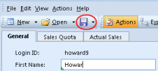

# Save Changes

To save your changes, click the **Save** button.

Click the **Save** arrow, and in the menu click **Save and Close** to save and close the form in one operation. Click **Save and Next** to save and open the next object in the table in the same form. Below, this will save changes for Howard and open Michael.

**Keyboard shortcuts:**

*   To save, press CTRL + S.
*   To save and close the form in one operation, press CTRL + ALT + S.
*   To save and open the next object in the table in one operation, press CTRL + SHIFT + S.