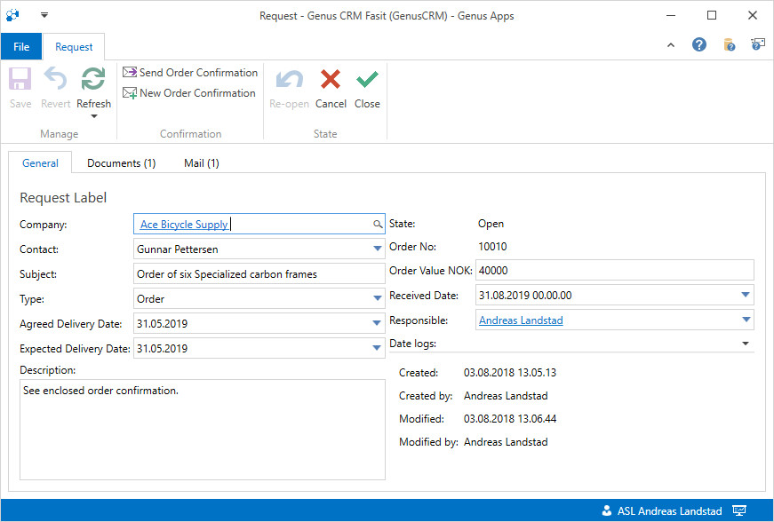

# What is a form?

A Genus Form in Genus Desktop is a user interface which typically allows the user to create, modify or analyse data. A simple Form may for example allow you to simply type in name and phone number to a customer, whereas another Form may be the basis for one or several steps in a larger business process.

A Form may contain simple fields that show texts and dates or more complex components like references to other obects or maps, tables, analysis or images.

A Ribbon (command bar) at the top usally shows some important actions that you can perform in the interface.

