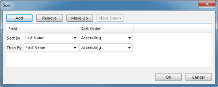

## View Settings

A table displays its objects in a layout called a view.

A view is composed of columns, which also are called fields. A view controls the way objects are sorted and grouped, which objects (rows) are displayed on so on.

You may personalize your views and save your settings. The settings are automatically remembered and used the next time you start your Genus application. In the table, right-click the column headings, and then click **View Settings**. You can reset your personlize view to default view. In The table, right-click the column headings, and then click **Reset View**.

Alternatively, on the **View** menu, click **View Setting** to set your personlize view or click**Reset** **View** to reset the view to default.

 

The dialog box below will appear.

## Add, Remove or Move a Field <a name="add-remove-or-move-a-field"/>

1.  In the table, right-click the column headings, and then click **View Settings**.
2.  Click **Fields**.
3.  In the **Field Chooser** dialog box, to add a field, select the field you want to add.
4.  In the **Field Chooser** dialog box, to remove a field, clear the field you want to remove.
5.  In the **Field Chooser** dialog box, to move a field, click the field you want to move, and then click **Move Up** or **Move Down** until the field is in the position that you want**.**

## Group Objects

A group is a set of objects with one common attribute, for example employees within a department. When you group objects in a table, the objects are displayed below a shared heading.

1.  In the table, right-click the column headings, and then click **View Settings**.
2.  Click **Group By**.
3.  Click **Add** to add a row to the field list.
4.  In the newly added row, in the **Group By** box, select a field.
5.  You can enhance grouping by selecting a group interval in the **Group Interval** box. For example, you can group purchases by date and then include group intervals that show totals for each day, month, or year. Intervals are not confined to fields with the date/time data type, however. You can also use them with text and number fields as well. For example, a Company Namefield could have intervals that segment results by the first letter of the company.
6.  In the **Initial Display** box, select if the groups should be expanded or collapsed as default.
7.  To group by an additonal field, click **Add** again.
8.  To remove fields, select a field row and click **Remove**.
9.  If you have grouped on additional fields, select a row and click **Move Up** or **Move Down** to change grouping order.

## Sort Objects

1.  In the table, right-click the column headings, and then click **View Settings**.
2.  Click **Sort**.
3.  Click **Add** to add a row to the field list.
4.  To sort in ascending alphanumeric order, click **Ascending**. To sort in descending alphanumeric order, click **Descending**.
5.  To sort by additional fields, click **Add** again.

****

**Note**. If a field is a reference to a [code domain](../../../../terminology.md), data are sorted according to the logical sort order defined for the code domain, which not necessarily equals the alphanumeric order. For example, in a code domain which defines some kind of workflow status, the codes may be specified in the following sort order: Not Started, In Progress and Completed.

## Other Settings

If you double-click an object in a table, the contents of the object are displayed in a form. You can specify if forms by default should be opened in the same window or in a new window:

1.  In the table, right-click the column headings, and then click **View Settings**.
2.  Click **Other Settings**.
3.  To open forms in the same window, click **Open forms in the same window**. When a form is opened, the window containing the table is added to your browsing history. To switch back to the table, click the **Back** button on the toolbar.
4.  To open forms in a new window, click **Open forms in a new window**. When a form is opened, the table still appears in a different window, so you can switch between the windows.
5.  To use the settings recommended by your system administrator, click **Use default settings**.

## Filter Data

A filter is an easy way to see only those objects that meets the conditions you specify. When you filter objects, you selectively choose which objects that should appear in the table.

1.  In the table, right-click the column headings, and then click **View Settings**.
2.  Click **Filter**.
3.  In the **Filter** dialog box, specify a [condition](../../../../developers/defining-the-app-model/common-concepts/conditions.md "Conditions") stating which objects to display, for example, _timesheets submitted by employees this week which not have been approved_.

