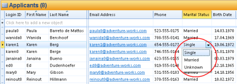

## Modify an Object

Objects may be modified directly in the table, for example by clicking a dropdown and selecting a new value, as seen below.

The change will be saved automatically.

Some tables require you to save manually, by clicking the **Save** button, as seen below. In such cases you may do multiple changes in the table before saving your changes.

Text fields may be edited directly in the table.

Some tables do not allow you to edit directly, but require you to open an object in a form before modifying it. See [Open an Object](open-an-object.md "Open an Object") for more information.