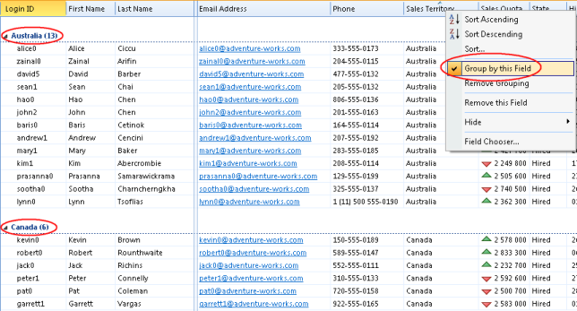

# Sort, Group and Autofilter Objects

To sort your data, simply click the column header. Click one more time to reverse the sort order.

Hold down SHIFT and click another column header to sort on multiple columns.

You may right click a column header, and in the menu, click **Sort Ascending** or **Sort Descending**.

Clicking **Sort...** will open a dialog box, where you may sort on multiple columns (fields), as shown below.

To group your data, right click a column header, and in the menu, click **Group by this Field**. Repeat this if you want to remove the grouping.

If you want to group by additional fields, hold down the CTRL key, right-click the column heading of the next field, and the click **Group by this Field**.

To filter your data by using an **Autofilter**, click the arrow in the column header to display a list of values to filter on. Please note that the arrow is not visible until you move the cursor over the column header. The list contains all distinct values from the column.

Click on a value to filter the data, and only show the rows with this value.

To select more than one value, click the check boxes next to the values.

To select all press CTRL+A, or to deselect all press CTRL+SHIFT+A.