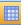
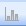
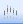
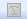

## Chart Types

Reports support many types of charts to help you display data in ways that are meaningful to your audience. When you create a chart or change the type of an existing chart, you can select one of the following chart types:

<table style="HEIGHT: 382px; WIDTH: 101.64%">

<tbody>

<tr>

<th>Chart Types</th>

<th>Description</th>

</tr>

<tr>

<td>**Normal View**</td>

<td>Display values in a table.</td>

</tr>

<tr>

<td>**Vertical Bar**</td>

<td>Display values as bars along the Y axis with the members along the X axis.</td>

</tr>

<tr>

<td>**Horizontal Bar**</td>

<td>Display values as bars along the X axis with the member along the Y axis.</td>

</tr>

<tr>

<td>**Pie**</td>

<td>Display values with one pie displayed per member and one pie slice per value.</td>

</tr>

<tr>

<td>**Line**</td>

<td>Display value as lines plotted along the Y axis, with the members along the X axis. The curve style and plot points may be customized per value.</td>

</tr>

<tr>

<td>**Combination**</td>

<td>Display values along the Y axis with the members along the X axis. The appearance of the value may be customized (bar, line or area) along with curve stile and plot points.</td>

</tr>

<tr>

<td>**Plot**</td>

<td>Plot points when the two first visible values are used to determine the position of the point ; the first value is used for the position in horizontal direction, while the second value is used for the vertical position. If more values are specified, they are used as values in a small chart in the plot point. The small charts can be displayed as either pies or bars.</td>

</tr>

<tr>

<td>**Trend**</td>

<td>Display trends in data.</td>

</tr>

<tr>

<td>**Meter**</td>

<td>

Display values with one meter per member. Requires three visible values; the first is used for the meter value and the two following and used for min and max range. If more values are specified, they will be used as markers along the meter.

</td>

</tr>

<tr>

<td>

**Vertical Gauge**

**Horizontal Gauge**

</td>

<td>

Display values with one gauge per member. Requires 3 visible values; the first is used for the gauge value and the two following are used for min and max range. If more values are specified, they will be used as markers along the gauge. Combined with if, you can set requirements to indicator to get different color.

</td>

</tr>

<tr>

<td>

**Vertical Indicator**

**Horizontal Indicator**

</td>

<td>

Indicator require a single visible value that is based on a logical If function. The number of indication are based on the number of criteria in the If function.

</td>

</tr>

</tbody>

</table>

The chart types must be published, to allow user to present data with charts.

For more information about publishing functions, see [Publishing Functions and Options](publishing functions and options.md).