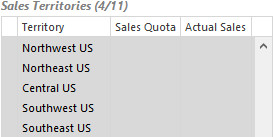
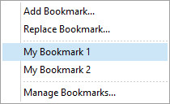

## Use an Analysis

The main concept of an Analysis is to let the user select items of interest, and then provide feedback based on the current selection. All elements in the analysis are immediately updated based on which items in the underlying data mart are now relevant. All aggregated information like measures and charts are updated, lists display wich items are relevant and which are excluded, and so on.

In this article

* * *

*   [Selected, Qualified, and Excluded Items](#selected-qualified-and-excluded-items)

*   [Selecting and Deselecting Items](#selecting-and-deselecting-items)

*   [Back and Forward](#back-and-forward)

*   [Bookmarks](#bookmarks)

* * *

## Selected, Qualified, and Excluded Items <a name="selected-qualified-and-excluded-items"/>

The main concept in an Analysis is to give feedback based on the items that are selected at any given time. An item can be selected, qualified, or excluded. Sometimes an item can also be selected and excluded at the same time.

*   **Selected**: Items are selected if the user has selected them by explicitly by clicking them.
*   **Qualified**: Items are qualified if they are connected to all the selected items according to the definition of the data mart and the analysis. Items that are qualified are included in aggregations and calculations, and can be selected to further specify the subset.
*   **Excluded**: Items are excluded if they are not connected to all ??

In a list or grid, the feedback is given by displaying items in a format which reflects the state of an item. In this article, List is used as a common term for various listing of items.

**Selected**

Items in a list are selected if the user has clicked them, and these items are displayed:

<table>

<tbody>

<tr>

<td>

*   In bold text
*   With a green filled circle

</td>

<td>

</td>

</tr>

</tbody>

</table>

An item can be visualized more than one place in an analysis, and if it is clicked and selected one place, it is visualized as selected all other places.

**Qualified**

Items in a list are Qualified if they are not selected and not excluded. Normally this is the case when the items are connected to all the selected items in the analysis.

These items are displayed without any special formatting:

*   In normal text
*   On white background

<table>

<tbody>

<tr>

<td>

*   In normal text
*   On white background

</td>

<td>

</td>

</tr>

</tbody>

</table>

This is the normal state for all items in lists when an analysis is opened.

**Excluded**

Items in a list are excluded if they have no connection to the selected items, and these items are displayed:

<table>

<tbody>

<tr>

<td>

*   On gray background

</td>

<td>

</td>

</tr>

</tbody>

</table>

## Selecting and Deselecting Items

There are several ways to change the selections in an analysis. The simplest way is by clicking elements, sometimes in combination with pressing **CTRL** or **SHIFT** keys. It is also possible to right click and select from the shortcut menu. The shortcut menu also contains additional options for changing selections. Items can be selected in charts, lists, grids, etc. In this article List is used as a common term for various forms of item listings.

**Select Items**  
To select an item in a list , click the item, or right click the item and select **Set as Selected** in the shortcut menu.

To select several items in a list, press and hold the CTRL key, then click the items, and then release the CTRL key. To select a sequence of items in a list, press and hold the SHIFT key, click the first item in the sequence, then click the last item in the sequence, and then release the SHIFT key.  

It is also possible to select items in charts, but the charts present aggregated information, and thereby every point or bar also represents an aggregated value for the given category. So when a point, bar, or pie slice is selected, what is actually selected is the category for that value. For example: In a chart showing sales amount per month, when selecting a bar, the month is selected. Similarly, in a pie chart showing sales amount per region, when selecting a pie slice, the region is selected. In a pie chart it is also possible to make selections by clicking items in the legend.  

To add items to an existing selection in a list, press and hold the **CTRL** key, click the items to add, and then release the **CTRL** key. It is also possible to right click the item to add, and select **Add to Selection** in the shortcut menu.  

In a list, it is sometimes possible to select items that are already excluded. When selecting an item that is excluded, it is no longer meaningful to maintain the existing selections, as this would exclude all items. Therefore when an excluded item is selected, all other selections are automatically cleared.

**Deselect Items**  
To deselect an item in a list, when it is the only selected item in the list, click the item.

To remove items from an existing selection in a list, press and hold the **CTRL** key, click the selected items to remove, and then release the **CTRL** key, or right click a selected item to remove, and select **Remove from Selection** in the shortcut menu.

It is only possible to deselect an item in a chart, when it is the only selected item.  

**Select All**

To select all items in a list, right click in the list, and select **Select All** in the shortcut menu.

The result of selecting all items, and selecting none, is not the same. This is the case where there are combinations of data which are not connected to any items in the list. Selecting no items excludes nothing, while selecting all items excludes everything that is not connected.

**Select Possible**

To select all items that are not excluded in a list, right click in the list, and select **Select Possible** in the shortcut menu.

**Select Excluded**

To select all items that are excluded in a list, right click in the list, and select **Select Excluded** in the shortcut menu.

**Clear Selection**

To remove the selections of all items that are selected in a list, right click the list, and select **Clear Selection** in the shortcut menu.

**Clear Other Selections**

To remove the selections of all items that are selected anywhere, except in a specific list, right click the list, and select **Clear Other Selections** in the shortcut menu.  

**Clear All Selections**

To remove the selections of all items that are selected anywhere, right click the list, and select **Clear All Selections** in the shortcut menu.

## Back and Forward

When using an analysis to discover new insight about your data, each selection that is made is like a step into uncharted territory. Sometimes it reveals new discoveries, sometimes it leads nowhere. Instead of having to remember each step, to be able to retreat the same way you came, use **Back** to undo the last steps. If you change your mind, use **Forward** to re-do the selection again. The last 100 steps are stored, so step back and forward freely to re-play the sequence and better visualize and understand the data.

## Bookmarks

A bookmark saves the current set of selections in the analysis, and lets you easily re-apply the selections at a later time. This is useful if you discover something in your data that you need to take a closer look at. Create a personal bookmark, or share it with others and even send them a link.

**Add a bookmark**

To add a bookmark for the current set of selections, in the toolbar click the add bookmark button . Revise the values in the **Bookmark Window** and click **OK**.

*   **Name.** The name of the bookmark. Use informative names that are easy to understand, especially if the bookmark is shared with other users. The default name for C% new bookmark is a timestamp.
*   **Description**. Optionally enter a description to give more information about what the bookmark displays when it is applied.
*   **Popup message when this bookmark is opened**. Select this option to show the description in a popup windows when the bookmark is applied. This is useful if the bookmark is shared with other users, and it is necessary to convey special information about the bookmark.
*   **Share this bookmark with other users**. Select this option if the bookmark should be available for all the users that have access to the analysis.
*   **Send to mail recipient**. Send a an e-mail with this bookmark to other users. To use the bookmark, the recipients must have been granted the appropriate permissions to the analysis.

**Apply a bookmark**  

To apply a bookmark, in the toolbar click the down arrow next tot the add bookmark button . In the list of bookmarks, click the bookmark to apply.

When a bookmark is applied, all the current selections are cleared.

**Share a bookmark**

To let other users see and use one of your bookmarks, select the **Share this bookmark with other users** when adding a new bookmark, or select the option for an existing bookmark in **Manage bookmarks**.

**Replace a bookmark**

It is possible to update the saved set of selections for an existing bookmark. This is useful in certain situations, for example if a shared bookmark is used for showing information on a selection that changes manually; "The current cost cutting focus areas". There is only one bookmark which is shared, and the content changes over time.

To update the saved set of selections for an existing bookmark, make the required selections in the analysis, in the toolbar click the down arrow next tot the add bookmark button . and click **Replace Bookmark**, then in the list of bookmarks, click the bookmark to replace.

**Manage bookmarks**

You can manage your bookmarks to get an overview, modify them, remove them, send them to other users, or look at the history to see when the bookmarks were used and by who.

To manage your bookmarks, in the toolbar click the down arrow next tot the add bookmark button , and click **Manage Bookmarks**.

In the **Manage Bookmarks** window select the bookmark to manage and click the button that corresponds to the action you want to perform; **Modify**, **Remove**, **Send**, or click **History** to view the history.

