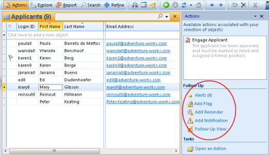

## Follow Up

Use Reminders and Notifications to help you follow up on objects.

Adding a reminder to an object gives you an alert at the given time.

Adding a notification to an object gives you an alert when a certain event has occured, for example when someone has modified the object or changed permissions for it.

Note that Reminders, and Notifications may not be available for all objects.

<table cellpadding="0" cellspacing="0" width="100%" class="cdclvSuggestTable">

<tbody>

<tr>

<td width="100%" class="cdclvSuggestTitle">Topics in "Follow Up"</td>

<td class="cdclvSuggestTitle"><nobr>3 items</nobr></td>

</tr>

<tr>

<td class="cdclvCategoryCont" colspan="2">

<table cellpadding="0" cellspacing="0" width="100%">

<tbody>

<tr>

<td valign="top" class="cdclvCategoryCol1">[Reminders](follow up/reminders.md)</td>

<td valign="top" class="cdclvCategoryCol2">[Notifications](follow up/notifications.md)</td>

</tr>

<tr class="cdclvCategoryRowAlt">

<td valign="top" class="cdclvCategoryCol1">[Alerts](follow up/alerts.md)</td>

<td valign="top" class="cdclvCategoryCol2"></td>

</tr>

</tbody>

</table>

</td>

</tr>

</tbody>

</table>