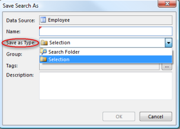

# Save Searches and Selections

You can save your search as a Search Folder, or your search result as a selection for later use. A Search Folder is a saved search based on given criteria, and the result of the search can change over time. Each time you open a search folder, it will search for objects based on the saved criteria. It is useful for example when you want a list over Employees with age over 30\. A selection is a collection of the objects you have saved.

To save a search or selection, do the following:

1.  [Search for objects](search-for-objects.md "Search for Objects") by enter your search criteria in search fields or in [Advanced Search](using-advanced-search.md "Using Advanced Search").
2.  After performing your search, click  in the search field, and then in the menu, click **Save Search As**.
3.  Type a name in the **Name** box.
4.  In the **Save as Type** box, select **Search Folder** to save the search with criteria, or select **Selection**to save the set of spesific objects you have found.
5.  Optionally add a group and tags to organize your searches.
6.  Click **OK.**

You can also save specific objects from the search result as selection by [selecting the objects](../navigate-view-modify-and-control/working-in-tables/select-objects.md "Select Objects") you want to save. Right-click on one of the selected objects, and in the menu, point to **Search Result**, and then click **Save Selected as Selection**.

For information on how to open a search, see [Open a search](open-a-search.md "Open a Search") and [Viewing Search Results](viewing-search-results.md "Viewing Search Results").