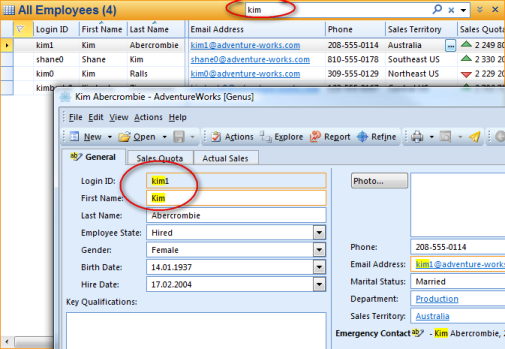

# Search Options

To change the default settings for search, do the following:

1.  On the **toolbar** menu, click **Search** to open Search Panel.
2.  In the **Task** section, click **Search Options**.
3.  If you want to highlight the words you have searched for, in the **Search Result** section, click **Highlight the words that I have searched for when opening an object**.  
    
4.  In the **Near query** section enter a number to specify the maximum distance between two words for full text queries using the NEAR operator. The operator returns a score based on the proximity of two or more query terms. The default value is 20, whereas the minimum value is 3.

When the hightlight option is selected, it will give following result:

