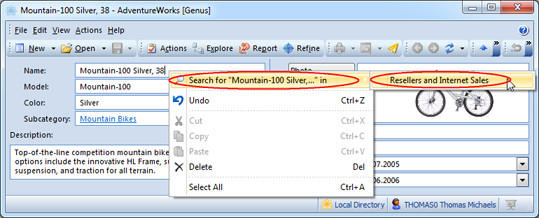
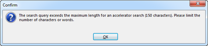

## Search with Accelerators

An accelerator search is a fast way to use some of the information in the form, to search for other data.

Place the cursor in a box with the text you want to search for, and then right-click and select **Search for " ... " in**. In the list of available accelerators, select the accelerator to use.

The result is presented in [Search Results](viewing search results.md "Viewing Search Results").

To only use parts of the text for searching, select the part to use before right-clicking.

Due to performance issues, the maximum length of the search term is 150 characters. If the search term exceeds the limit, the search will not be executed. You must then return to the field and select a maximum of 150 characters, before performing the search again.

For more information on how to make accelerator search available, see [Search Settings](../../developers/defining the application model/tables/views.md "Search Settings").