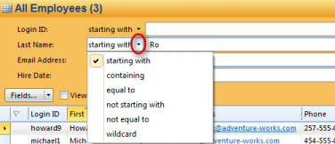
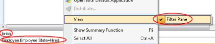

## Search for Objects

To search for objects, in the table header, click inside the search box, type the text you want to find and press enter or click the magnifying glass. You can also press F3 to access the search field. The search will be performed on relevant fields, and the result is presented in the table.

To specify the field for one or more search words, type the field name without spaces, followed by a colon, and then the search word.

Use the format <field name>:<search word>, where the field name is case insensitive and is typed without spaces.

**Search Pane**  
To specify a search in more detail, open the Search Pane by clicking the View Search Pane button to the right of the search field, or by pressing CTRL+F3\.

Enter search criteria in the appropriate fields and click **Search**, or click  and then click one of the options from the menu. If it is uncertain how many objects the search will return, select **View Number of Objects Found** to avoid unnecessary waiting. Click **Clear Fields** to empty all search fields.

To add search fields that is currently not visible, or to hide some of the search fields that are not used, click Fields. In the Select Search Fields dialog, add or remove fields as required.

Note that you may change search operators per field by clicking the arrow to the left of each field. The set of available search operators depends on the type of the field. The operators for text fields are shown below.

In some search fields, you can select predefined search values as for example My Sales Territory.

**Reset Search fields**  
To reset the visible search fields to the default settings, click the down arrow on the **Fields** button, and select **Reset**.

**Close search**  
To close a search, click  in the search field, and in the menu select **Close Search**. You can also close a search by clicking  in the search field, or by pressing CTRL+F5\. Close a search will close the search result and bring back to the default search result. It will also clear all search fields.

Note: Close Search is not available in a table based on search, for example in the [search results](viewing-search-results.md "Viewing Search Results") .  

**Filter Pane**  
It can be useful to turn on the Filter Pane to view the filters currently applied in the table. Right-click inside your table, and in the menu, select View and click Filter Pane. The Filter Pane will appear at the table footer. The Filter Pane will also display any default or mandatory filters applied to your table.

