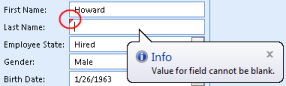
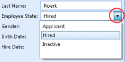
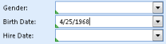
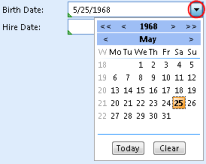
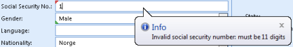
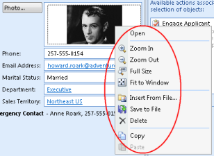
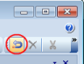

## Modify an Object

To modify an object, click inside the field where you want to change data. Type your changes in the field, and press the TAB key to move to the next field.

Some fields are read only, i.e. you may not change their value, like howard9 as the **Login ID** above.

Any required fields or fields containing invalid data are indicated by small red triangles. You will not be able to save your changes before all such fields are filled or corrected.

Click an arrow to select between predefined values.

In such fields you may also start typing before clicking a value. This will filter the list of predefined values for you.

**Keyboard shortcut:** You may press the up or down arrow key on your keyboard, and then the TAB key to select.

Enter or modify dates by typing the date.

For English US dates, use a slash mark or a hyphen to separate the parts of a date; for example, type 25/4/1968 or 25-april-1968\. Please check the **Regional and Language Options** on your computer to find out the formats that apply on your computer.

**Keyboard shortcut:** Press key down or key up to change parts of a date. **Tip:** If a field is empty, pressing key down or key up will insert today's date.

Click the arrow to open a date picker.

For some fields special rules apply, like fields for entering email addresses or social security numbers. The rules are dependent on your specific application. Contact your super user or system administrator for more information.

To add a photo, drag a photo file from your computer and drop inside a photo or image field.

Right-click inside the photo or image field to open a menu with a selection of commands.

To revert your changes, click the **Revert** button. **Note!** This will revert changes for all fields you modified since you last saved or opened the object.

