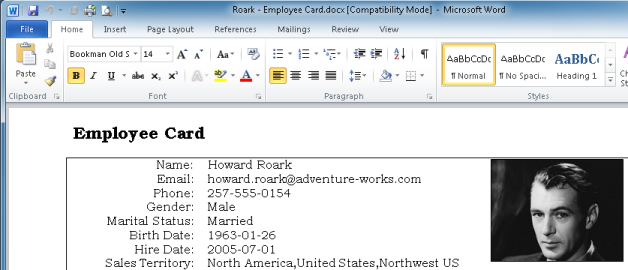

## Print an Object

To print an object, click the **Print** button, and in the menu click a report, like **Employee Card** below.

Alternatively, in the **File** menu, point to **Print** and click a report.

A preview will be opened in another application, like Microsoft Word shown below. Complete the print operation inside that application.

