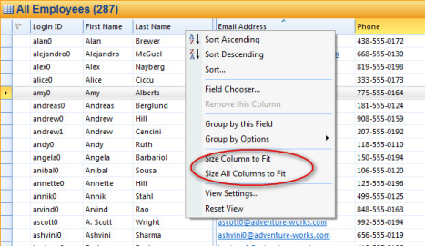

## Size columns

Size Column to Fit will resize the chosen column to the length of the longest text.  
Size All Column to Fit will resize all columns in the table to adjusting itself to the length of the longest text.

Right-click on the column header, and click **Size column to F****it** or **Size All Columns to Fit**.

Alternatively, move the pointer between two columns and double-click.

