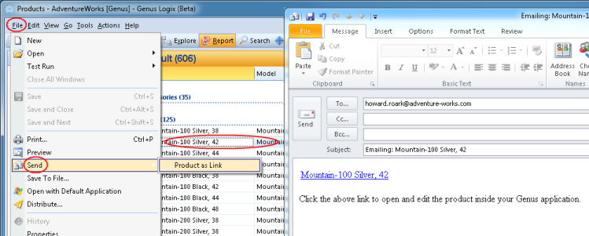
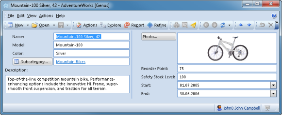

## Send Objects

To send objects, on the **File** menu, point to **Send**, and then click an action, like **Product as Link** shown below.

In this case a Microsoft Outlook mail window appears, with a link to the object. You may edit the mail contents before clicking **Send** inside Microsoft Outlook.

When the recipient opens the received mail and clicks the link, the object is opened as shown below.

The user is requirede to enter a user name and password when clicking a link before the object is opened.

Alternatively, you may right-click a row, and in the menu, select **Send** and click an action.

The use of **Send** is dependent on your specific application. Contact your system administrator if the Send feature seems to lack in your specific context.