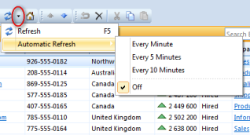

## Refresh a View

Data is fetched the first time you open a table, and not automatically updated with changes done by other users.

To fetch data again, in the menu, click the **Refresh** button.  Your table will be updated with any changes done by other users.

**Keyboard shortcut:** You may also press F5.

To automatically refresh the data, click the **Refresh** arrow, and in the menu click **Automatic Refresh**. I the sub-menu, click an interval or **Off**.

**Automatic Refresh** is reset to **Off** when you close your Genus application.